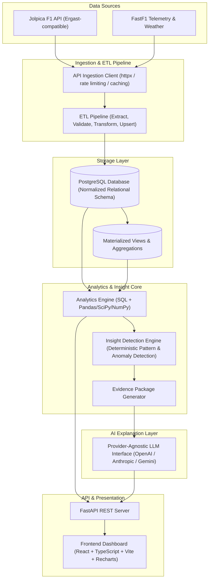
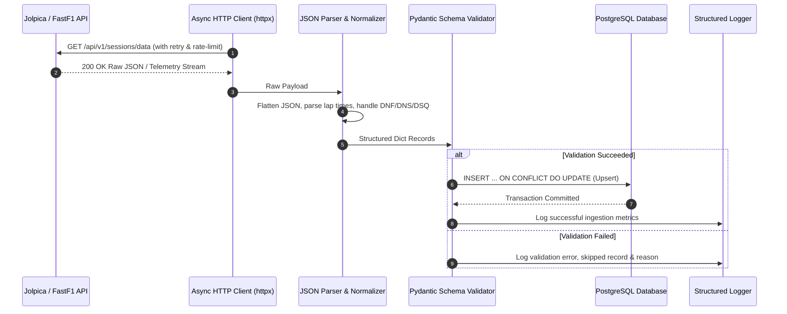
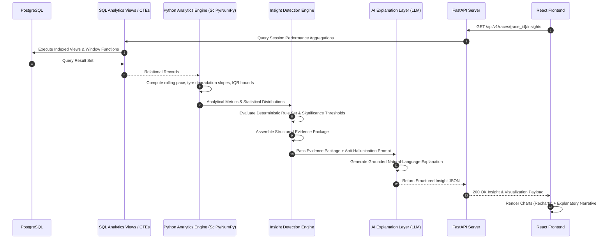
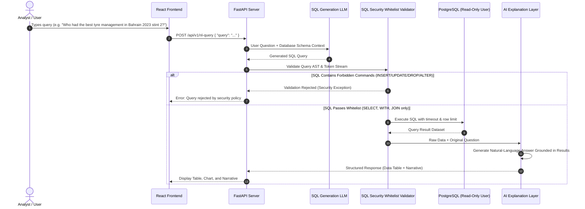

# F1 Race Intelligence — System Architecture

## 1. System Overview

**F1 Race Intelligence** is a modular, layered analytics platform designed to ingest historical and modern Formula 1 telemetry, lap times, race results, and weather data, store it within a normalized relational database, compute deterministic statistical analytics and anomaly signals, and synthesize natural-language strategic insights using evidence-grounded AI explanation models.

The platform separates deterministic data computation from probabilistic narrative generation:
- **Core Analytics & Insight Detection:** Strictly deterministic (SQL window functions, NumPy, SciPy, statistical significance testing).
- **AI Narrative Layer:** Strictly explanatory, consuming structured evidence packages to produce natural-language explanations without inventing metrics or hallucinating statistical data.
- **Frontend Dashboard:** Modern, responsive, interactive React/TypeScript user interface backed by FastAPI REST endpoints.

---

## 2. High-Level Architecture Diagram

---

## 3. Component Details

### 3.1 Data Ingestion Layer

The Data Ingestion Layer manages network-level interactions with external motorsport data providers, ensuring resilient data retrieval with caching, pagination, and rate limit compliance.

- **Primary Source: Jolpica F1 API**
  - Ergast-compatible REST API (`https://api.jolpi.ca/ergast/f1/`).
  - Provides core relational datasets: seasons, circuits, constructors, drivers, race schedules, race results, qualifying sessions, sprint races, lap charts, and pit stops.
- **Secondary Source: FastF1 Python Library**
  - Provides high-resolution session data: car telemetry (speed, throttle, brake, gear, RPM, DRS), sector times, tyre compound histories, stint lengths, track status, weather measurements (air/track temp, humidity, rainfall), and GPS coordinates.
- **Key Responsibilities:**
  - **Async HTTP Client:** Built with `httpx.AsyncClient` supporting connection pooling, timeout configurations, and exponential backoff retry strategies.
  - **Rate Limiting & Throttling:** Token-bucket or fixed-window rate limiters to avoid API quotas and 429 throttling.
  - **Response Caching:** Local disk-based and in-memory caching for immutable historical data (e.g., past season race results).
  - **Pagination Handling:** Automatic iteration across limit/offset paginated endpoints.
  - **Error Recovery:** Graceful degradation on partial payload drops, socket disconnects, or upstream service downtime.
  - **Raw Payload Archiving:** Retains raw JSON responses for auditability and reproducible ingestion reruns.

---

### 3.2 ETL Pipeline

The ETL (Extract, Transform, Load) Pipeline standardizes heterogeneous external data formats into structured relational models before persisting them to the database.

- **Extract:**
  - Executes batch and delta extractions from external APIs via the Ingestion Layer.
  - Checks watermarks and latest stored season/round indicators to fetch only uncollected or updated sessions.
- **Transform:**
  - **Schema Normalization:** Flattens nested JSON payloads into relational entity records.
  - **Edge-Case Normalization:** Standardizes non-finishing codes (`DNF`, `DNS`, `DSQ`, `NC`, `EX`, `DNQ`), assigning uniform status flags and numeric rank defaults.
  - **Time & Duration Parsing:** Converts formatted time strings (`"1:23.456"`, `"+1.234"`, `"PT24.123S"`) into standardized floating-point seconds and PostgreSQL `INTERVAL` types.
  - **Type Validation:** Validates data against strict Pydantic schemas before database operations.
- **Load:**
  - Performs idempotent upserts (`INSERT ... ON CONFLICT DO UPDATE`) against PostgreSQL tables.
  - Enforces transactional atomicity per race weekend to prevent partially ingested states.
- **Logging & Data Quality:**
  - Structured structured logging (using `structlog` or `loguru`).
  - Logs skipped records, schema discrepancies, unmapped driver/constructor IDs, and data anomalies.

---

### 3.3 Database Layer

A PostgreSQL database acts as the single source of truth, enforcing relational integrity, constraints, and optimized indexing for complex analytical queries.

- **Technology:** PostgreSQL 15+
- **ORM & Schema Migration:** SQLAlchemy 2.0 (declarative mapping with type annotations) and Alembic for automated schema versioning and migrations.
- **Core Relational Schema:**
  - `seasons`: Year, championship regulations reference, URL.
  - `circuits`: Circuit key, name, location, country, latitude, longitude, altitude.
  - `constructors`: Constructor key, name, nationality, active status.
  - `drivers`: Driver key, code, permanent number, full name, nationality, date of birth.
  - `races`: Season, round, circuit reference, race name, official date, session timestamps.
  - `race_results`: Race ID, driver ID, constructor ID, grid position, finish position, points, laps completed, time, status, fastest lap details.
  - `qualifying_results`: Race ID, driver ID, constructor ID, Q1 time, Q2 time, Q3 time, final qualifying rank.
  - `sprint_results`: Sprint race outcomes, points, finishing positions.
  - `pit_stops`: Race ID, driver ID, stop number, lap number, time of day, duration (seconds), total pit lane time.
  - `lap_times`: Granular per-lap data: Race ID, driver ID, lap number, lap position, lap time (milliseconds/seconds).
  - `driver_standings`: Standings snapshot post-round: driver ID, season, round, points, position, wins.
  - `constructor_standings`: Standings snapshot post-round: constructor ID, season, round, points, position, wins.
- **Performance & Constraints:**
  - Foreign key constraints with cascading rules where appropriate.
  - B-tree and composite indexes on frequent query predicates: `(race_id, driver_id)`, `(season, round)`, `(driver_id, lap_number)`.
  - Materialized views for compute-heavy multi-season aggregations (e.g., driver career head-to-head metrics, constructor pit stop distributions).

---

### 3.4 Analytics Engine

The Analytics Engine combines SQL analytics with Python data science libraries to compute rigorous, repeatable performance metrics.

- **Dual-Layer Analytics Architecture:**
  - **SQL-Based Analytics:** Utilizes SQL Common Table Expressions (CTEs), window functions (`AVG() OVER(...)`, `LAG()`, `LEAD()`, `RANK()`, `NTILE()`), and partition clauses for set-based performance analysis (lap-by-lap delta, pit-window loss calculations, tyre degradation slope initial estimates).
  - **Python Analytics Layer:** Employs Pandas, NumPy, and SciPy for multi-variate statistical analysis, distribution modeling, and telemetry signal processing.
- **Statistical Computations:**
  - **Rolling Averages & Pace Normalization:** Rolling lap pace excluding in-laps, out-laps, safety car periods, and yellow flags.
  - **Tyre Degradation Modeling:** Linear and polynomial regression fitting on lap times per tyre compound over stint length.
  - **Teammate Head-to-Head Comparisons:** Delta pace analysis between drivers in identical machinery during qualifying and clean-air race stints.
  - **Pit Stop Performance:** Kernel Density Estimation (KDE) and interquartile range (IQR) calculations for stationary pit times.
  - **Outlier & Anomaly Detection:** Z-score, modified Z-score (median absolute deviation), and isolation forest algorithms for spotting sudden pace drops, mechanical issues, and strategic undercut/overcut anomalies.
- **Data Dictionary Compliance:** All metrics are formally cataloged in a data dictionary with defined units, mathematical formulations, and validation bounds prior to code implementation.

---

### 3.5 Insight Detection Engine

The Insight Detection Engine evaluates analytical results against deterministic criteria to generate verified candidate findings.

- **Deterministic Pattern Detection:**
  - Evaluates rule sets and statistical thresholds (e.g., pace divergence $> 2.5\sigma$, pit stop duration variance exceeding 95th percentile, overtake efficiency delta under wet-to-dry transitions).
  - Verifies statistical significance with calculated $p$-values and confidence intervals.
- **Candidate Finding & Evidence Package Generation:**
  - When an anomaly or significant pattern is confirmed, the engine packages the underlying data into a structured **Evidence Package**.
  - **Evidence Package Contents:**
    - Metric identifiers, baseline comparison values, and observed values.
    - Sample sizes ($N$), statistical significance metrics ($p$-value, confidence intervals, $\sigma$-levels).
    - Detailed analytical methodology used (e.g., "5-lap clean-air rolling median pace comparison").
    - Direct references to raw records (race IDs, lap numbers, driver IDs, timestamps).
- **Strict Analytical Separation:** **Zero AI/LLM involvement in detection.** Findings are discovered solely through deterministic mathematical and statistical algorithms.

---

### 3.6 AI Explanation Layer

The AI Explanation Layer translates structured evidence packages into clear, contextualized, human-readable race intelligence narratives.

- **Provider-Agnostic LLM Interface:**
  - Unified client interface supporting pluggable backends (OpenAI, Anthropic Claude, Google Gemini, local models via Ollama/vLLM).
  - Structured prompt templates enforcing role, context, and output schema.
- **Input Grounding:**
  - Accepts *only* structured Evidence Packages generated by the Insight Detection Engine.
  - Temperature set to low deterministic settings ($\le 0.2$) with strict JSON output schemas.
- **Structured Output Format:**
  - `title`: Concise headline describing the insight.
  - `summary`: One or two sentence high-level executive summary.
  - `severity` / `impact`: Importance classification (`high`, `medium`, `low`, `informational`).
  - `evidence`: Bulleted factual evidence extracted directly from the package.
  - `metrics`: Exact numbers, baselines, and deltas.
  - `methodology`: Explanation of how the metric was derived.
  - `explanation`: Contextual analysis explaining *why* this occurred based on the provided evidence.
  - `confidence`: Analytical confidence score ($0.0 - 1.0$).
  - `visualization_metadata`: Chart type and data series suggestions for frontend rendering.
- **Anti-Hallucination Rules:**
  - Strict system prompt guardrails: The model must *never* introduce statistics, lap numbers, pit durations, or driver actions not explicitly present in the evidence package.
  - Rigid separation of established empirical facts vs. strategic interpretations.

---

### 3.7 API Server

The API Server exposes high-performance RESTful endpoints serving pre-computed race metrics, analytical queries, and structured insights to client applications.

- **Framework:** FastAPI (Python 3.11+) with ASGI server (Uvicorn).
- **Key Capabilities:**
  - **RESTful Endpoints:** Endpoints structured around seasons, races, drivers, constructors, telemetry, stint analysis, and insights.
  - **Async Execution:** Asynchronous DB queries using `asyncpg` and SQLAlchemy async session management.
  - **Response Caching:** In-memory Redis or FastAPICache middleware for frequently requested static race weekend datasets.
  - **Data Validation:** Pydantic models for request validation and response serialization.
  - **Security & Middleware:** CORS configuration, rate limiting per client IP, standard HTTP exception handlers, and OpenTelemetry instrumentation.

---

### 3.8 Frontend Dashboard

The Frontend Dashboard provides an interactive, data-dense, user interface for race engineers, analysts, and motorsport enthusiasts.

- **Technology Stack:** React 18+, TypeScript, Vite.
- **UI Components & Styling:** Modern CSS framework (Tailwind CSS) with clean typography, responsive layout grids, and full dark/light theme support.
- **Visualization:** Recharts / D3-based charting components for:
  - Lap time degradation curves and stint comparisons.
  - Telemetry traces (speed vs. distance, throttle/brake telemetry overlays).
  - Pit stop duration histograms.
  - Head-to-head qualifying delta sector breakdowns.
  - Championship trajectory graphs.
- **Architecture Principle:** **Zero client-side metric derivation.** The frontend strictly visualizes data structures received from the API Server.

---

## 4. Data Flow Diagrams

### 4.1 Ingestion Flow

---

### 4.2 Analytics & Insight Flow

---

### 4.3 Future "Ask-the-Data" Natural Language Query Flow

---

## 5. Security Considerations

To ensure data integrity, platform availability, and operational safety, the platform implements a defense-in-depth security model:

1. **Environment Configuration & Secret Management:**
   - Zero hardcoded credentials or API tokens in codebase or version control.
   - All credentials (PostgreSQL connection strings, LLM API keys, caching tokens) injected via `.env` files and managed with `pydantic-settings`.
   - `.env*` excluded in `.gitignore`.

2. **Least-Privilege Database Access:**
   - Primary application worker utilizes dedicated credentials scoped strictly to necessary tables.
   - Separate **Read-Only Database User** (`f1_readonly`) designated for analytical batch processing and natural language SQL execution engines.

3. **Strict SQL Whitelist & Query Sandboxing (Ask-the-Data Engine):**
   - Natural language SQL generator outputs undergo strict AST (Abstract Syntax Tree) and regex validation.
   - **Allowed Keywords:** `SELECT`, `WITH`, `JOIN`, `INNER JOIN`, `LEFT JOIN`, `WHERE`, `GROUP BY`, `HAVING`, `ORDER BY`, `LIMIT`, `UNION ALL`.
   - **Explicitly Forbidden Tokens:** `INSERT`, `UPDATE`, `DELETE`, `DROP`, `ALTER`, `TRUNCATE`, `CREATE`, `GRANT`, `REVOKE`, `EXECUTE`, `COPY`, `pg_`, `information_schema`.
   - Hard query timeout constraints (e.g., `statement_timeout = 3000ms`) and maximum row return caps (`LIMIT 500`).

4. **API Protection & Network Controls:**
   - CORS middleware restricted to designated frontend origins.
   - Rate limiting on public API routes to mitigate denial-of-service attempts.
   - Strict input validation on all query parameters, path variables, and request bodies via Pydantic.

---

## 6. Technology Stack

| Layer | Technology | Version / Tool | Purpose |
|---|---|---|---|
| **Database** | PostgreSQL | 15+ | Primary relational storage for telemetry, lap times, standings, and results |
| **ORM** | SQLAlchemy | 2.0+ | Type-safe database mapping, relationship modeling, and async session management |
| **Migrations** | Alembic | 1.13+ | Version-controlled database schema evolution and automated migrations |
| **Backend API** | FastAPI | 0.110+ | Asynchronous REST API server with OpenAPI auto-documentation |
| **Data Processing** | Pandas, NumPy | 2.0+ / 1.26+ | Array manipulation, dataframe transformations, and tabular computations |
| **Statistics & ML** | SciPy, scikit-learn | 1.12+ / 1.4+ | Statistical distribution modeling, regression, hypothesis testing, anomaly detection |
| **HTTP Client** | httpx | 0.27+ | Async HTTP client with connection pooling, retries, and rate limiting |
| **Telemetry Ingestion** | FastF1 | 3.3+ | Specialized access to live and historical F1 telemetry, weather, and GPS streams |
| **Frontend Framework** | React + TypeScript | 18+ / 5.0+ | Reactive, type-safe user interface dashboard |
| **Frontend Build Tool** | Vite | 5.0+ | Modern high-speed build tool and local development server |
| **Data Visualization** | Recharts / D3.js | 2.12+ | Interactive charts, pace degradation curves, and telemetry visualizations |
| **AI Explanation** | LLM APIs | OpenAI / Anthropic / Gemini | Provider-agnostic natural language narrative synthesis grounded in evidence packages |
| **Data Validation** | Pydantic | 2.6+ | Input/output schema validation and configuration management |
| **Infrastructure** | Docker, GitHub Actions | 25+ | Containerization, automated testing, and CI/CD deployment pipelines |

---

## 7. Design Principles

1. **Separation of Concerns:**
   - Ingestion fetches raw payloads without altering schemas.
   - ETL transforms and guarantees database integrity.
   - Analytics computes mathematical metrics deterministically.
   - Insight Engine isolates statistical significance from narrative synthesis.
   - AI layer explains evidence without generating or modifying underlying data.
   - Frontend renders received datasets without performing client-side metric derivation.

2. **Data Integrity over Convenience:**
   - Enforce database foreign keys, unique constraints, and schema validations at every layer.
   - Unrecognized driver codes, non-standard finish conditions, or missing sector splits are explicitly handled and logged rather than quietly discarded or approximated.

3. **Evidence Before Narrative:**
   - No narrative insight is delivered without an underlying, verifiable Evidence Package containing raw data points, sample sizes, metric formulas, and statistical confidence levels.

4. **Incremental Implementation:**
   - System components are modular and decoupled via defined interfaces and schemas, enabling phased development from basic lap-time ingestion to advanced machine learning tyre models and Ask-the-Data queries.

5. **Reproducible Pipelines:**
   - Ingestion, ETL transformations, and analytical aggregations are idempotent. Re-running the pipeline on historical seasons yields identical relational states and insight findings.

6. **Observable Failures:**
   - All external API interactions, schema validation discrepancies, pipeline bottlenecks, and query rejections produce structured logs with actionable contextual metadata.
