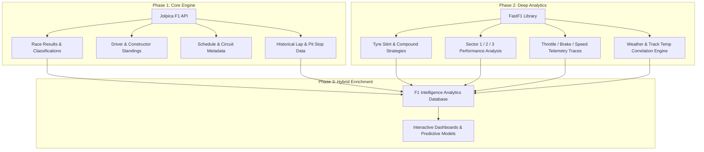

# F1 Race Intelligence — Data Sources & Ingestion Specification

This document provides a comprehensive technical reference for all primary and secondary data sources utilized by the **F1 Race Intelligence** platform. It details verified endpoint schemas, data types, pagination patterns, system limitations, and the multi-phase integration roadmap.

---

## 1. Jolpica F1 API (Primary Source)

- **Base URL**: `https://api.jolpi.ca/ergast/f1/`
- **Status**: **VERIFIED WORKING** (Validated September 2026)
- **Lineage**: Successor to the deprecated Ergast Developer API
- **Maintainer**: Open-source / volunteer community
- **Cost / License**: Free / Non-commercial open community access
- **Payload Format**: JSON (`application/json`)
- **Pagination Model**: Query parameters `limit` (default: `30`) and `offset` (default: `0`)

### 1.1 Architecture & Response Envelope

All Jolpica F1 endpoints return a top-level `MRData` object containing query metadata alongside the requested resource table:

```json
{
  "MRData": {
    "xmlns": "http://ergast.com/mrd/1.5",
    "series": "f1",
    "url": "https://api.jolpi.ca/ergast/f1/2025/1/results.json",
    "limit": "30",
    "offset": "0",
    "total": "20",
    "RaceTable": {
      "season": "2025",
      "round": "1",
      "Races": [ ... ]
    }
  }
}
```

> [!IMPORTANT]
> **Type Casting Required**: Jolpica API returns all numeric metrics (e.g., `position`, `points`, `grid`, `laps`, `millis`, `duration`) as strings. The ingestion pipeline must explicitly cast these values to integers or floating-point numbers.

---

### 1.2 Verified Endpoints & Field Schemas

#### A. Race Results — `/{season}/{round}/results.json`
Returns full finishing classification, championship points awarded, time deltas, and fastest lap metadata for a Grand Prix.

| Field Path | Type | Description / Notes |
| :--- | :--- | :--- |
| `number` | string | Car competition number (e.g., `"1"`, `"4"`, `"44"`) |
| `position` | string | Final classified finishing position (e.g., `"1"`) |
| `positionText` | string | Position label: numeric string (`"1"`, `"2"`) or `"R"` for retired, `"D"` for disqualified, `"W"` for withdrawn |
| `points` | string | Total championship points scored in the race (e.g., `"25"`, `"18"`, `"1"`) |
| `grid` | string | Starting grid position (e.g., `"1"`, `"0"` for pit lane start) |
| `laps` | string | Number of laps completed (e.g., `"58"`) |
| `status` | string | Classification status (e.g., `"Finished"`, `"+1 Lap"`, `"Engine"`, `"Accident"`, `"Collision"`) |
| `Driver.driverId` | string | Unique driver slug (e.g., `"max_verstappen"`, `"norris"`) |
| `Driver.permanentNumber` | string | Driver career permanent number (e.g., `"33"`, `"4"`) |
| `Driver.code` | string | 3-letter FIA driver abbreviation (e.g., `"VER"`, `"NOR"`) |
| `Driver.url` | string | Wikipedia/reference URL |
| `Driver.givenName` | string | Driver given name (e.g., `"Max"`) |
| `Driver.familyName` | string | Driver surname (e.g., `"Verstappen"`) |
| `Driver.dateOfBirth` | string | ISO 8601 date string (`"YYYY-MM-DD"`) |
| `Driver.nationality` | string | Driver nationality (e.g., `"Dutch"`, `"British"`) |
| `Constructor.constructorId` | string | Unique constructor slug (e.g., `"red_bull"`, `"mclaren"`, `"ferrari"`) |
| `Constructor.url` | string | Constructor Wikipedia/reference URL |
| `Constructor.name` | string | Official constructor name (e.g., `"Red Bull"`, `"McLaren"`) |
| `Constructor.nationality` | string | Team license nationality (e.g., `"Austrian"`, `"British"`) |
| `Time.millis` | string (optional) | Total race time in milliseconds (typically populated for race winner only) |
| `Time.time` | string (optional) | Absolute race time for winner (`"1:25:46.543"`), gap to winner for others (`"+3.456"`) |
| `FastestLap.rank` | string (optional) | Relative rank of driver's fastest lap in the race (`"1"` = fastest lap) |
| `FastestLap.lap` | string (optional) | Lap number on which fastest lap was set (e.g., `"52"`) |
| `FastestLap.Time.time` | string (optional) | Fastest lap time string (e.g., `"1:19.897"`) |

---

#### B. Qualifying Results — `/{season}/{round}/qualifying.json`
Returns knockout qualifying session results across Q1, Q2, and Q3 segments.

| Field Path | Type | Description / Notes |
| :--- | :--- | :--- |
| `number` | string | Car competition number |
| `position` | string | Qualifying classification rank (`"1"` through `"20"`) |
| `Driver` | object | Driver metadata entity (identical to Race Results schema) |
| `Constructor` | object | Constructor metadata entity (identical to Race Results schema) |
| `Q1` | string (optional) | Best lap time in Q1 session (e.g., `"1:17.512"`). May be absent if no time set |
| `Q2` | string (optional) | Best lap time in Q2 session (e.g., `"1:16.890"`). Null/absent for drivers eliminated in P16–P20 |
| `Q3` | string (optional) | Best lap time in Q3 session (e.g., `"1:16.234"`). Null/absent for drivers eliminated in P11–P20 |

---

#### C. Pit Stops — `/{season}/{round}/pitstops.json`
Returns individual pit stop events recorded during the Grand Prix.

| Field Path | Type | Description / Notes |
| :--- | :--- | :--- |
| `driverId` | string | Driver identifier slug (e.g., `"leclerc"`) |
| `lap` | string | Lap number during which the driver entered the pit lane |
| `stop` | string | Sequential pit stop index for that driver (`"1"`, `"2"`, `"3"`) |
| `time` | string | UTC / Local time of day when pit stop commenced (e.g., `"15:22:58"`) |
| `duration` | string | Total pit lane transit and stationary duration in seconds (e.g., `"21.341"`) |

> [!NOTE]
> **Pagination Required**: Normal race weekends produce 30 to 90 pit stop entries (e.g., 82 total entries for 2025 Round 1). Ingestion must page using `limit=100` or loop with `offset` increments.

---

#### D. Lap Times — `/{season}/{round}/laps.json`
Provides lap-by-lap tracking of every driver on every lap throughout the race.

| Field Path | Type | Description / Notes |
| :--- | :--- | :--- |
| `number` | string | Race lap number (`"1"` to `"78"`) |
| `Timings[].driverId` | string | Driver identifier slug |
| `Timings[].position` | string | Running track position at the completion of this lap (`"1"` to `"20"`) |
| `Timings[].time` | string | Lap duration formatted string (e.g., `"1:21.432"`) |

> [!WARNING]
> **High Volume Endpoint**: A standard 20-car race over 50–70 laps yields 900 to 1,400 timing records (e.g., 921 timings for 2025 Round 1). Ingestion requires exhaustive pagination using batch offsets.

---

#### E. Sprint Results — `/{season}/{round}/sprint.json`
Returns finishing classifications for Saturday Sprint races.

- **Availability**: Returns non-empty `SprintResults` array exclusively on Sprint weekends (e.g., empty array for 2025 R1 Albert Park, populated data for 2025 R2 Shanghai).
- **Structure**: Mirrors the **Race Results** schema:
  - `number`, `position`, `positionText`, `points`, `grid`, `laps`, `status`
  - `Driver` and `Constructor` objects
  - `Time` (`millis`, `time`)
  - `FastestLap` (`rank`, `lap`, `Time.time`)

---

#### F. Standings Endpoints

##### 1. Driver Standings — `/{season}/driverStandings.json`
- **Fields**:
  - `position`, `positionText`, `points`, `wins`
  - `Driver` object (`driverId`, `permanentNumber`, `code`, `givenName`, `familyName`, `nationality`)
  - `Constructors` (array of Constructor objects): Supports multi-team mid-season driver transfers (e.g., Liam Lawson, Yuki Tsunoda).

##### 2. Constructor Standings — `/{season}/constructorStandings.json`
- **Fields**:
  - `position`, `positionText`, `points`, `wins`
  - `Constructor` object (`constructorId`, `name`, `nationality`, `url`)

---

#### G. Core Reference Tables

| Endpoint | Primary Identifiers | Key Attributes Returned |
| :--- | :--- | :--- |
| `/{season}.json` | `season`, `round` | `raceName`, `date`, `time`, `Circuit` (circuitId, circuitName, Location), `FirstPractice`, `SecondPractice`, `ThirdPractice`, `Qualifying`, `Sprint` |
| `/circuits.json` | `circuitId` | `circuitName`, `url`, `Location` (`lat`, `long`, `locality`, `country`) |
| `/drivers.json` | `driverId` | `permanentNumber`, `code`, `givenName`, `familyName`, `dateOfBirth`, `nationality`, `url` |
| `/constructors.json` | `constructorId` | `name`, `nationality`, `url` |

---

### 1.3 Jolpica API Limitations & Edge Cases

1. **Strict Field Typing**: All numbers are serialized as strings.
2. **Special Status Strings**: `positionText` contains non-integer values (`"R"` for retired, `"D"` for disqualified).
3. **Sparse Properties**:
   - `Q2` / `Q3` attributes do not exist on drivers eliminated in earlier rounds.
   - `FastestLap` is absent for drivers who retired on Lap 0 or did not record a valid flying lap.
   - `Time.millis` is often only present on P1 (winner); subsequent finishers provide `Time.time` as gap deltas (e.g., `"+5.123"`).
4. **Missing Data Dimensions**:
   - No tyre compound or tyre stint degradation records.
   - No track or atmospheric weather metrics.
   - No car telemetry (speed, throttle, brake, RPM, gear, DRS).
   - No mini-sector or micro-sector times.
   - No Free Practice lap times.
   - Sprint Qualifying (SQ) session breakdowns not verified.
5. **Rate Limiting & Bulk Queries**: No bulk database dumps are offered; API consumers must implement polite rate limiting (recommended exponential backoff with a 200–500ms request spacing).

---

## 2. FastF1 Python Library (Secondary Source)

- **Package**: `pip install fastf1` (Requires Python 3.10+)
- **Status**: Researched & Validated (Scheduled for Phase 2 Integration)
- **Upstream Data Source**: Scraped from official Formula 1 Live Timing services
- **Cost / License**: Open-source under MIT License

### 2.1 Available Data Streams

```
+-------------------------------------------------------------------------+
|                           FastF1 Data Engine                            |
+--------------------+--------------------+-------------------------------+
|     Telemetry      |    Tyre & Stints   |     Weather & Environment     |
| - Speed (km/h)     | - Tyre Compound    | - Air Temperature (°C)        |
| - Throttle (0-100%)|   (SOFT/MED/HARD)  | - Track Temperature (°C)      |
| - Brake (bool)     | - Tyre Life (laps) | - Humidity (%)                |
| - RPM & Gear (1-8) | - Stint Number     | - Rainfall Flag (true/false)  |
| - DRS (0-14)       | - Pit In/Out Laps  | - Wind Speed & Direction      |
+--------------------+--------------------+-------------------------------+
|     Lap Times      |   GPS Coordinates  |      Session Breakdown        |
| - Sector 1, 2, 3   | - Track X, Y, Z    | - FP1, FP2, FP3               |
| - Speed Traps (I1) | - Corner Apexes    | - Qualifying & Sprint Shootout|
| - Deleted Lap Flags| - Driver Traces    | - Sprint & Grand Prix         |
+--------------------+--------------------+-------------------------------+
```

### 2.2 Native Integration & DataFrames

FastF1 extends Pandas DataFrames with specialized Formula 1 analysis utility methods:
- `session.load()`: Loads laps, telemetry, weather, and session metadata into memory.
- `laps.pick_fastest()`: Extracts the single fastest lap of a session or driver.
- `laps.pick_driver('VER')`: Filters lap dataset to a specific driver.
- `laps.pick_quicklaps()`: Filters out in-laps, out-laps, and laps affected by Safety Car / red flags.
- `lap.get_telemetry()`: Returns high-frequency time-series telemetry synchronized along distance and time channels.

### 2.3 Two-Stage Cache Architecture

FastF1 employs a high-performance two-stage local cache to minimize network overhead and avoid repeated scraping:
- **Primary Cache**: SQLite database for session schedule and index headers.
- **Payload Cache**: Pickle/binary serialization for high-frequency lap and telemetry data.

```python
import fastf1

# Enable local caching before invoking API queries
fastf1.Cache.enable_cache('data/cache/fastf1')

session = fastf1.get_session(2025, 'Bahrain', 'Q')
session.load()
```

### 2.4 FastF1 Limitations & Considerations

1. **Computational & Storage Overhead**: Full telemetry files for 20 drivers over a 60-lap race can generate 200MB+ of raw data per Grand Prix.
2. **Scraper Fragility**: Relying on live timing protocols means unexpected upstream schema updates can disrupt parsing until library patches are published.
3. **Historical Variance**: Detailed telemetry and GPS mapping are comprehensive for recent seasons (2018–present) but sparse or unavailable for older historical eras.
4. **Execution Latency**: Uncached initial downloads take 10–30 seconds per session depending on network throughput.

---

## 3. Data Source Selection Matrix

| Capability / Analysis Goal | Jolpica F1 API | FastF1 Library | Recommended Source |
| :--- | :---: | :---: | :--- |
| Official Race Results & Classifications | ✅ | ✅ | **Jolpica** (Lightweight, definitive) |
| World Championship Standings | ✅ | ❌ | **Jolpica** (Direct standings endpoint) |
| Career Historical Records & Bios | ✅ | ❌ | **Jolpica** (Historical archives) |
| Pit Stop Counts & Duration Records | ✅ | ⚠️ | **Jolpica** (Standardized pitstop API) |
| Sector Times (Sector 1, 2, 3) | ❌ | ✅ | **FastF1** (Detailed timing) |
| Tyre Compounds & Stint Degradation | ❌ | ✅ | **FastF1** (Compound tracking) |
| High-Frequency Telemetry & Speed Traces | ❌ | ✅ | **FastF1** (Sub-second car telemetry) |
| Track GPS Coordinates & Apex Speeds | ❌ | ✅ | **FastF1** (Spatial GPS coordinates) |
| Weather & Track Temperature Correlations | ❌ | ✅ | **FastF1** (Environmental streams) |
| Practice Session Lap Comparisons | ❌ | ✅ | **FastF1** (FP1/FP2/FP3 coverage) |

---

## 4. Multi-Phase Integration Roadmap



- **Phase 1 (Current)**: Ingest core race data, schedules, championship standings, pit stops, and lap histories using the verified Jolpica F1 REST API.
- **Phase 2**: Introduce a FastF1 ingestion worker to fetch and cache tyre compounds, sector times, weather records, and telemetry for deep-dive analysis.
- **Phase 3**: Harmonize Jolpica historical classifications with FastF1 high-frequency streams into unified analytical models.

---

## 5. Data Freshness & Ingestion Latency

| Data Source | Ingestion Window | Freshness SLA |
| :--- | :--- | :--- |
| **Jolpica F1 API** | Post-Session / Post-Race | Updated within 1–4 hours following official FIA classifications. |
| **FastF1 Library** | Post-Session Completion | Data available within 15–45 minutes following session conclusion. |

---

## 6. Licensing, Attribution & Disclaimers

1. **Jolpica F1 API**: Free, volunteer-maintained open-access API. Consumers must adhere to community terms of use and employ responsible request throttling.
2. **FastF1**: Open-source under the MIT License.
3. **Formula 1 / FIA Disclaimer**:
   > [!CAUTION]
   > This project and its data pipelines are purely for educational, analytical, and research purposes. This project is **not** associated, affiliated, endorsed, or sponsored by Formula One World Championship Limited, Formula One Licensing B.V., the Fédération Internationale de l'Automobile (FIA), or any Formula 1 team or driver. All Formula 1 trademarks, logos, and brand names are the property of their respective owners.
