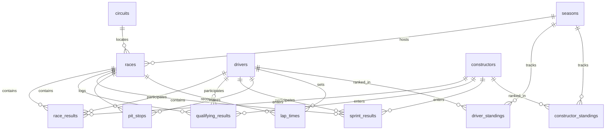

# F1 Race Intelligence — PostgreSQL Database Schema

This schema is designed based on **VERIFIED Jolpica API** response structures. All tables correspond directly to actual data fields that exist in the API.

---

## Design Principles

- **Normalized relational design**: 3NF for core tables.
- **Natural & Surrogate Keys**: API string identifiers (`driver_id`, `circuit_id`, `constructor_id`) are preserved as natural keys with unique constraints, while surrogate integer primary keys (`id SERIAL PRIMARY KEY`) are used for efficient internal referencing and foreign key relations.
- **Foreign keys enforced**: Strict referential integrity across all related tables.
- **Indexes on commonly queried columns**: Optimized for race, driver, constructor, and season-level query patterns.
- **Nullable fields for legitimately optional data**: Handles non-finishers (DNF/DNS/DSQ), historic records, missing grid positions, and session variations.
- **Timestamps for ETL tracking**: `created_at` and `updated_at` on persistent records.
- **Idempotent upsert support**: Composite `UNIQUE` constraints allow safe `ON CONFLICT DO UPDATE` execution in ETL pipelines.

---

## Entity Relationship Overview



---

## Tables

### 1. seasons

Represents Formula 1 championship seasons.

```sql
CREATE TABLE seasons (
    season_year INTEGER PRIMARY KEY,
    url TEXT
);
```

| Column | Type | Constraints | Description |
| :--- | :--- | :--- | :--- |
| `season_year` | `INTEGER` | `PRIMARY KEY` | Four-digit championship year (e.g., `2024`) |
| `url` | `TEXT` | | Wikipedia / reference URL for the season |

---

### 2. circuits

Tracks and venues hosting Formula 1 Grand Prix events.

```sql
CREATE TABLE circuits (
    id SERIAL PRIMARY KEY,
    circuit_id VARCHAR(100) UNIQUE NOT NULL,  -- 'albert_park'
    circuit_name VARCHAR(255) NOT NULL,       -- 'Albert Park Grand Prix Circuit'
    locality VARCHAR(255),                     -- 'Melbourne'
    country VARCHAR(255),                      -- 'Australia'
    latitude DECIMAL(10,6),
    longitude DECIMAL(10,6),
    url TEXT,
    created_at TIMESTAMP DEFAULT CURRENT_TIMESTAMP,
    updated_at TIMESTAMP DEFAULT CURRENT_TIMESTAMP
);
```

| Column | Type | Constraints | Description |
| :--- | :--- | :--- | :--- |
| `id` | `SERIAL` | `PRIMARY KEY` | Surrogate integer identifier |
| `circuit_id` | `VARCHAR(100)` | `UNIQUE`, `NOT NULL` | API slug/natural identifier (e.g., `'albert_park'`, `'monaco'`) |
| `circuit_name` | `VARCHAR(255)` | `NOT NULL` | Official circuit name |
| `locality` | `VARCHAR(255)` | | City or locality |
| `country` | `VARCHAR(255)` | | Country name |
| `latitude` | `DECIMAL(10,6)` | | GPS latitude coordinate |
| `longitude` | `DECIMAL(10,6)` | | GPS longitude coordinate |
| `url` | `TEXT` | | Reference / Wikipedia URL |
| `created_at` | `TIMESTAMP` | `DEFAULT CURRENT_TIMESTAMP` | Row creation timestamp |
| `updated_at` | `TIMESTAMP` | `DEFAULT CURRENT_TIMESTAMP` | Row last update timestamp |

---

### 3. constructors

Formula 1 teams and constructors.

```sql
CREATE TABLE constructors (
    id SERIAL PRIMARY KEY,
    constructor_id VARCHAR(100) UNIQUE NOT NULL,  -- 'mclaren'
    name VARCHAR(255) NOT NULL,                    -- 'McLaren'
    nationality VARCHAR(100),                      -- 'British'
    url TEXT,
    created_at TIMESTAMP DEFAULT CURRENT_TIMESTAMP,
    updated_at TIMESTAMP DEFAULT CURRENT_TIMESTAMP
);
```

| Column | Type | Constraints | Description |
| :--- | :--- | :--- | :--- |
| `id` | `SERIAL` | `PRIMARY KEY` | Surrogate integer identifier |
| `constructor_id` | `VARCHAR(100)` | `UNIQUE`, `NOT NULL` | API slug/natural identifier (e.g., `'mclaren'`, `'ferrari'`) |
| `name` | `VARCHAR(255)` | `NOT NULL` | Constructor / team display name |
| `nationality` | `VARCHAR(100)` | | Country of origin |
| `url` | `TEXT` | | Reference / Wikipedia URL |
| `created_at` | `TIMESTAMP` | `DEFAULT CURRENT_TIMESTAMP` | Row creation timestamp |
| `updated_at` | `TIMESTAMP` | `DEFAULT CURRENT_TIMESTAMP` | Row last update timestamp |

---

### 4. drivers

Formula 1 racing drivers.

```sql
CREATE TABLE drivers (
    id SERIAL PRIMARY KEY,
    driver_id VARCHAR(100) UNIQUE NOT NULL,   -- 'norris'
    permanent_number INTEGER,                  -- 1 (can be NULL for very old drivers)
    code VARCHAR(3),                           -- 'NOR' (can be NULL for some historical drivers)
    given_name VARCHAR(255) NOT NULL,
    family_name VARCHAR(255) NOT NULL,
    date_of_birth DATE,
    nationality VARCHAR(100),
    url TEXT,
    created_at TIMESTAMP DEFAULT CURRENT_TIMESTAMP,
    updated_at TIMESTAMP DEFAULT CURRENT_TIMESTAMP
);
```

| Column | Type | Constraints | Description |
| :--- | :--- | :--- | :--- |
| `id` | `SERIAL` | `PRIMARY KEY` | Surrogate integer identifier |
| `driver_id` | `VARCHAR(100)` | `UNIQUE`, `NOT NULL` | API slug/natural identifier (e.g., `'norris'`, `'verstappen'`) |
| `permanent_number` | `INTEGER` | | Driver career permanent number (e.g., `4`, `1`; NULL for historical drivers) |
| `code` | `VARCHAR(3)` | | Three-letter broadcast abbreviation (e.g., `'NOR'`, `'VER'`) |
| `given_name` | `VARCHAR(255)` | `NOT NULL` | First / given name |
| `family_name` | `VARCHAR(255)` | `NOT NULL` | Last / family name |
| `date_of_birth` | `DATE` | | Birthdate |
| `nationality` | `VARCHAR(100)` | | Driver nationality |
| `url` | `TEXT` | | Reference / Wikipedia URL |
| `created_at` | `TIMESTAMP` | `DEFAULT CURRENT_TIMESTAMP` | Row creation timestamp |
| `updated_at` | `TIMESTAMP` | `DEFAULT CURRENT_TIMESTAMP` | Row last update timestamp |

---

### 5. races

Grand Prix race events scheduled and held per season.

```sql
CREATE TABLE races (
    id SERIAL PRIMARY KEY,
    season_year INTEGER NOT NULL REFERENCES seasons(season_year),
    round INTEGER NOT NULL,
    race_name VARCHAR(255) NOT NULL,           -- 'Australian Grand Prix'
    circuit_id INTEGER NOT NULL REFERENCES circuits(id),
    race_date DATE NOT NULL,
    race_time TIME,                             -- '04:00:00' UTC
    url TEXT,
    created_at TIMESTAMP DEFAULT CURRENT_TIMESTAMP,
    updated_at TIMESTAMP DEFAULT CURRENT_TIMESTAMP,
    UNIQUE(season_year, round)
);
CREATE INDEX idx_races_season ON races(season_year);
CREATE INDEX idx_races_circuit ON races(circuit_id);
```

| Column | Type | Constraints | Description |
| :--- | :--- | :--- | :--- |
| `id` | `SERIAL` | `PRIMARY KEY` | Surrogate integer identifier |
| `season_year` | `INTEGER` | `NOT NULL`, `REFERENCES seasons(season_year)` | Championship season year |
| `round` | `INTEGER` | `NOT NULL` | Round number in the season |
| `race_name` | `VARCHAR(255)` | `NOT NULL` | Official Grand Prix event title |
| `circuit_id` | `INTEGER` | `NOT NULL`, `REFERENCES circuits(id)` | Foreign key to circuit |
| `race_date` | `DATE` | `NOT NULL` | Date of the Grand Prix race |
| `race_time` | `TIME` | | Race start time in UTC |
| `url` | `TEXT` | | Reference / Wikipedia URL |
| `created_at` | `TIMESTAMP` | `DEFAULT CURRENT_TIMESTAMP` | Row creation timestamp |
| `updated_at` | `TIMESTAMP` | `DEFAULT CURRENT_TIMESTAMP` | Row last update timestamp |

---

### 6. race_results

Final classified results for each driver in a Grand Prix.

```sql
CREATE TABLE race_results (
    id SERIAL PRIMARY KEY,
    race_id INTEGER NOT NULL REFERENCES races(id),
    driver_id INTEGER NOT NULL REFERENCES drivers(id),
    constructor_id INTEGER NOT NULL REFERENCES constructors(id),
    car_number INTEGER,
    grid_position INTEGER,                      -- Starting grid (can be NULL for DNS or pit lane starts)
    source_position INTEGER,                     -- Jolpica `position`; preserve even for retired rows
    position_text VARCHAR(10) NOT NULL,          -- '1', '2', 'R', 'D', 'E', 'W', 'F', 'N'
    points DECIMAL(5,2) NOT NULL DEFAULT 0,
    laps_completed INTEGER NOT NULL DEFAULT 0,
    status VARCHAR(100) NOT NULL,               -- 'Finished', 'Lapped', '+1 Lap', 'Retired', etc.
    time_millis BIGINT,                          -- Finish time in milliseconds (winner: absolute; others: NULL or gap)
    time_text VARCHAR(50),                       -- '+0.895' or '1:42:06.304'
    fastest_lap_rank INTEGER,                    -- Rank among all fastest laps
    fastest_lap_number INTEGER,                  -- Which lap was fastest
    fastest_lap_time VARCHAR(20),                -- raw '1:22.167'
    fastest_lap_time_millis INTEGER,             -- parsed fastest lap duration
    created_at TIMESTAMP DEFAULT CURRENT_TIMESTAMP,
    UNIQUE(race_id, driver_id)
);
CREATE INDEX idx_race_results_race ON race_results(race_id);
CREATE INDEX idx_race_results_driver ON race_results(driver_id);
CREATE INDEX idx_race_results_constructor ON race_results(constructor_id);
```

| Column | Type | Constraints | Description |
| :--- | :--- | :--- | :--- |
| `id` | `SERIAL` | `PRIMARY KEY` | Surrogate integer identifier |
| `race_id` | `INTEGER` | `NOT NULL`, `REFERENCES races(id)` | Foreign key to race |
| `driver_id` | `INTEGER` | `NOT NULL`, `REFERENCES drivers(id)` | Foreign key to driver |
| `constructor_id` | `INTEGER` | `NOT NULL`, `REFERENCES constructors(id)` | Foreign key to constructor |
| `car_number` | `INTEGER` | | Car number entered for the event |
| `grid_position` | `INTEGER` | | Starting grid slot (NULL for pit lane start or DNS) |
| `source_position`| `INTEGER` | | Numeric Jolpica `position` / source classification order. Preserve even for retired rows; NULL only when source position is absent. |
| `position_text` | `VARCHAR(10)` | `NOT NULL` | Raw API status code (`'1'`, `'2'`, `'R'`, `'D'`, `'W'`, etc.) |
| `points` | `DECIMAL(5,2)`| `NOT NULL`, `DEFAULT 0` | Championship points awarded |
| `laps_completed` | `INTEGER` | `NOT NULL`, `DEFAULT 0` | Total laps completed |
| `status` | `VARCHAR(100)`| `NOT NULL` | Source classification status (e.g., `'Finished'`, `'Lapped'`, `'+1 Lap'`, `'Engine'`) |
| `time_millis` | `BIGINT` | | Total race duration in ms (winner) or gap |
| `time_text` | `VARCHAR(50)` | | Formatted race time string |
| `fastest_lap_rank` | `INTEGER` | | Rank of driver's fastest lap in race (1 = fastest lap) |
| `fastest_lap_number`| `INTEGER` | | Lap on which fastest lap was set |
| `fastest_lap_time` | `VARCHAR(20)`| | Raw fastest lap time string (e.g., `'1:22.167'`) |
| `fastest_lap_time_millis` | `INTEGER`| | Parsed fastest lap time in milliseconds |
| `created_at` | `TIMESTAMP` | `DEFAULT CURRENT_TIMESTAMP` | Row creation timestamp |

---

### 7. qualifying_results

Official qualifying session classifications.

```sql
CREATE TABLE qualifying_results (
    id SERIAL PRIMARY KEY,
    race_id INTEGER NOT NULL REFERENCES races(id),
    driver_id INTEGER NOT NULL REFERENCES drivers(id),
    constructor_id INTEGER NOT NULL REFERENCES constructors(id),
    car_number INTEGER,
    position INTEGER NOT NULL,
    q1_time VARCHAR(20),                        -- raw '1:15.912' (NULL if no time set)
    q1_time_millis INTEGER,
    q2_time VARCHAR(20),                        -- raw, NULL if eliminated in Q1
    q2_time_millis INTEGER,
    q3_time VARCHAR(20),                        -- raw, NULL if eliminated in Q1 or Q2
    q3_time_millis INTEGER,
    created_at TIMESTAMP DEFAULT CURRENT_TIMESTAMP,
    UNIQUE(race_id, driver_id)
);
CREATE INDEX idx_qualifying_race ON qualifying_results(race_id);
CREATE INDEX idx_qualifying_driver ON qualifying_results(driver_id);
```

| Column | Type | Constraints | Description |
| :--- | :--- | :--- | :--- |
| `id` | `SERIAL` | `PRIMARY KEY` | Surrogate integer identifier |
| `race_id` | `INTEGER` | `NOT NULL`, `REFERENCES races(id)` | Foreign key to race |
| `driver_id` | `INTEGER` | `NOT NULL`, `REFERENCES drivers(id)` | Foreign key to driver |
| `constructor_id` | `INTEGER` | `NOT NULL`, `REFERENCES constructors(id)` | Foreign key to constructor |
| `car_number` | `INTEGER` | | Car number |
| `position` | `INTEGER` | `NOT NULL` | Final qualifying position |
| `q1_time` | `VARCHAR(20)` | | Fastest lap time in Q1 session (NULL if no time set) |
| `q1_time_millis` | `INTEGER` | | Parsed Q1 lap time in milliseconds |
| `q2_time` | `VARCHAR(20)` | | Fastest lap time in Q2 session (NULL if eliminated in Q1) |
| `q2_time_millis` | `INTEGER` | | Parsed Q2 lap time in milliseconds |
| `q3_time` | `VARCHAR(20)` | | Fastest lap time in Q3 session (NULL if eliminated before Q3) |
| `q3_time_millis` | `INTEGER` | | Parsed Q3 lap time in milliseconds |
| `created_at` | `TIMESTAMP` | `DEFAULT CURRENT_TIMESTAMP` | Row creation timestamp |

---

### 8. sprint_results

Official classifications for Sprint race sessions.

```sql
CREATE TABLE sprint_results (
    id SERIAL PRIMARY KEY,
    race_id INTEGER NOT NULL REFERENCES races(id),
    driver_id INTEGER NOT NULL REFERENCES drivers(id),
    constructor_id INTEGER NOT NULL REFERENCES constructors(id),
    car_number INTEGER,
    grid_position INTEGER,
    source_position INTEGER,
    position_text VARCHAR(10) NOT NULL,
    points DECIMAL(5,2) NOT NULL DEFAULT 0,
    laps_completed INTEGER NOT NULL DEFAULT 0,
    status VARCHAR(100) NOT NULL,
    time_millis BIGINT,
    time_text VARCHAR(50),
    fastest_lap_rank INTEGER,
    fastest_lap_number INTEGER,
    fastest_lap_time VARCHAR(20),
    fastest_lap_time_millis INTEGER,
    created_at TIMESTAMP DEFAULT CURRENT_TIMESTAMP,
    UNIQUE(race_id, driver_id)
);
CREATE INDEX idx_sprint_race ON sprint_results(race_id);
```

| Column | Type | Constraints | Description |
| :--- | :--- | :--- | :--- |
| `id` | `SERIAL` | `PRIMARY KEY` | Surrogate integer identifier |
| `race_id` | `INTEGER` | `NOT NULL`, `REFERENCES races(id)` | Foreign key to race |
| `driver_id` | `INTEGER` | `NOT NULL`, `REFERENCES drivers(id)` | Foreign key to driver |
| `constructor_id` | `INTEGER` | `NOT NULL`, `REFERENCES constructors(id)` | Foreign key to constructor |
| `car_number` | `INTEGER` | | Car number |
| `grid_position` | `INTEGER` | | Starting grid position |
| `source_position`| `INTEGER` | | Numeric Jolpica `position` / source classification order. Preserve even for retired rows; NULL only when source position is absent. |
| `position_text` | `VARCHAR(10)` | `NOT NULL` | Classification status code |
| `points` | `DECIMAL(5,2)`| `NOT NULL`, `DEFAULT 0` | Sprint championship points |
| `laps_completed` | `INTEGER` | `NOT NULL`, `DEFAULT 0` | Laps completed in sprint |
| `status` | `VARCHAR(100)`| `NOT NULL` | Classification status string |
| `time_millis` | `BIGINT` | | Total time or interval in milliseconds |
| `time_text` | `VARCHAR(50)` | | Formatted time string |
| `fastest_lap_rank` | `INTEGER` | | Fastest lap rank |
| `fastest_lap_number`| `INTEGER` | | Lap number of fastest lap |
| `fastest_lap_time` | `VARCHAR(20)`| | Fastest lap time string |
| `created_at` | `TIMESTAMP` | `DEFAULT CURRENT_TIMESTAMP` | Row creation timestamp |

---

### 9. pit_stops

In-race pit stop data with duration and lap timing.

```sql
CREATE TABLE pit_stops (
    id SERIAL PRIMARY KEY,
    race_id INTEGER NOT NULL REFERENCES races(id),
    driver_id INTEGER NOT NULL REFERENCES drivers(id),
    stop_number INTEGER NOT NULL,               -- 1, 2, 3...
    lap INTEGER NOT NULL,
    time_of_day VARCHAR(20),                    -- raw '15:22:58' time-of-day
    duration_text VARCHAR(20),                  -- raw duration, e.g. '20.647' or '40:55.302'
    duration_millis BIGINT,                     -- parsed duration in milliseconds
    created_at TIMESTAMP DEFAULT CURRENT_TIMESTAMP,
    UNIQUE(race_id, driver_id, stop_number)
);
CREATE INDEX idx_pit_stops_race ON pit_stops(race_id);
CREATE INDEX idx_pit_stops_driver ON pit_stops(driver_id);
```

| Column | Type | Constraints | Description |
| :--- | :--- | :--- | :--- |
| `id` | `SERIAL` | `PRIMARY KEY` | Surrogate integer identifier |
| `race_id` | `INTEGER` | `NOT NULL`, `REFERENCES races(id)` | Foreign key to race |
| `driver_id` | `INTEGER` | `NOT NULL`, `REFERENCES drivers(id)` | Foreign key to driver |
| `stop_number` | `INTEGER` | `NOT NULL` | Stop sequence for this driver in this race (1, 2, ...) |
| `lap` | `INTEGER` | `NOT NULL` | Race lap on which the pit stop occurred |
| `time_of_day` | `VARCHAR(20)` | | Raw time of day when pit stop was made (e.g., `'15:22:58'`) |
| `duration_text` | `VARCHAR(20)` | | Raw source duration string; may be seconds (`'20.647'`) or minute-based (`'40:55.302'`) |
| `duration_millis` | `BIGINT` | | Parsed total pit-lane duration in milliseconds |
| `created_at` | `TIMESTAMP` | `DEFAULT CURRENT_TIMESTAMP` | Row creation timestamp |

---

### 10. lap_times

Individual lap-by-lap timing and positional tracking for every driver.

```sql
CREATE TABLE lap_times (
    id SERIAL PRIMARY KEY,
    race_id INTEGER NOT NULL REFERENCES races(id),
    driver_id INTEGER NOT NULL REFERENCES drivers(id),
    lap_number INTEGER NOT NULL,
    position INTEGER NOT NULL,                   -- Position at end of this lap
    time VARCHAR(20) NOT NULL,                   -- '1:22.167' (lap time as string)
    time_millis INTEGER,                          -- Parsed lap time in milliseconds
    created_at TIMESTAMP DEFAULT CURRENT_TIMESTAMP,
    UNIQUE(race_id, driver_id, lap_number)
);
CREATE INDEX idx_lap_times_race ON lap_times(race_id);
CREATE INDEX idx_lap_times_driver ON lap_times(driver_id);
CREATE INDEX idx_lap_times_race_lap ON lap_times(race_id, lap_number);
```

> [!IMPORTANT]
> **Scale Notice**: This is the **LARGEST** table in the database.
> - For a single race with 20 drivers and ~57 laps: **~1,140 rows**
> - For a full season of 24 races: **~27,360 rows**
> - For 10 seasons: **~273,600 rows**
> Composite indexes (`idx_lap_times_race_lap`, `idx_lap_times_race`, `idx_lap_times_driver`) are critical for real-time race chart generation and telemetry correlation.

| Column | Type | Constraints | Description |
| :--- | :--- | :--- | :--- |
| `id` | `SERIAL` | `PRIMARY KEY` | Surrogate integer identifier |
| `race_id` | `INTEGER` | `NOT NULL`, `REFERENCES races(id)` | Foreign key to race |
| `driver_id` | `INTEGER` | `NOT NULL`, `REFERENCES drivers(id)` | Foreign key to driver |
| `lap_number` | `INTEGER` | `NOT NULL` | Lap number |
| `position` | `INTEGER` | `NOT NULL` | Track position at the end of this lap |
| `time` | `VARCHAR(20)` | `NOT NULL` | Raw lap time string (e.g., `'1:22.167'`) |
| `time_millis` | `INTEGER` | | Parsed lap duration in milliseconds |
| `created_at` | `TIMESTAMP` | `DEFAULT CURRENT_TIMESTAMP` | Row creation timestamp |

---

### 11. driver_standings

World Drivers' Championship standings computed after each round.

```sql
CREATE TABLE driver_standings (
    id SERIAL PRIMARY KEY,
    season_year INTEGER NOT NULL REFERENCES seasons(season_year),
    round INTEGER NOT NULL,                      -- Standings after this round
    driver_id INTEGER NOT NULL REFERENCES drivers(id),
    position INTEGER NOT NULL,
    points DECIMAL(7,2) NOT NULL,
    wins INTEGER NOT NULL DEFAULT 0,
    created_at TIMESTAMP DEFAULT CURRENT_TIMESTAMP,
    UNIQUE(season_year, round, driver_id)
);
CREATE INDEX idx_driver_standings_season ON driver_standings(season_year);
```

> [!NOTE]
> A driver may have driven for multiple constructors in a single season (e.g., Liam Lawson driving for both RB and Red Bull Racing in 2025). The standings API returns an array of Constructors. Standings are stored without constructor references here; specific constructor associations are captured accurately per round in `race_results`.

| Column | Type | Constraints | Description |
| :--- | :--- | :--- | :--- |
| `id` | `SERIAL` | `PRIMARY KEY` | Surrogate integer identifier |
| `season_year` | `INTEGER` | `NOT NULL`, `REFERENCES seasons(season_year)` | Championship season year |
| `round` | `INTEGER` | `NOT NULL` | Standings after this round number |
| `driver_id` | `INTEGER` | `NOT NULL`, `REFERENCES drivers(id)` | Foreign key to driver |
| `position` | `INTEGER` | `NOT NULL` | Championship position |
| `points` | `DECIMAL(7,2)`| `NOT NULL` | Cumulative points total |
| `wins` | `INTEGER` | `NOT NULL`, `DEFAULT 0` | Cumulative race wins in season |
| `created_at` | `TIMESTAMP` | `DEFAULT CURRENT_TIMESTAMP` | Row creation timestamp |

---

### 12. constructor_standings

World Constructors' Championship standings computed after each round.

```sql
CREATE TABLE constructor_standings (
    id SERIAL PRIMARY KEY,
    season_year INTEGER NOT NULL REFERENCES seasons(season_year),
    round INTEGER NOT NULL,
    constructor_id INTEGER NOT NULL REFERENCES constructors(id),
    position INTEGER NOT NULL,
    points DECIMAL(7,2) NOT NULL,
    wins INTEGER NOT NULL DEFAULT 0,
    created_at TIMESTAMP DEFAULT CURRENT_TIMESTAMP,
    UNIQUE(season_year, round, constructor_id)
);
CREATE INDEX idx_constructor_standings_season ON constructor_standings(season_year);
```

| Column | Type | Constraints | Description |
| :--- | :--- | :--- | :--- |
| `id` | `SERIAL` | `PRIMARY KEY` | Surrogate integer identifier |
| `season_year` | `INTEGER` | `NOT NULL`, `REFERENCES seasons(season_year)` | Championship season year |
| `round` | `INTEGER` | `NOT NULL` | Standings after this round number |
| `constructor_id` | `INTEGER` | `NOT NULL`, `REFERENCES constructors(id)` | Foreign key to constructor |
| `position` | `INTEGER` | `NOT NULL` | Championship position |
| `points` | `DECIMAL(7,2)`| `NOT NULL` | Cumulative points total |
| `wins` | `INTEGER` | `NOT NULL`, `DEFAULT 0` | Cumulative race wins in season |
| `created_at` | `TIMESTAMP` | `DEFAULT CURRENT_TIMESTAMP` | Row creation timestamp |

---

## ETL Metadata Table

Tracks ingestion runs, synchronization status, record counts, and errors across data extraction pipelines.

```sql
CREATE TABLE etl_log (
    id SERIAL PRIMARY KEY,
    source VARCHAR(50) NOT NULL,                -- 'jolpica', 'fastf1'
    entity_type VARCHAR(50) NOT NULL,           -- 'race_results', 'qualifying', etc.
    endpoint VARCHAR(255),                      -- '/2024/5/results.json'
    source_url TEXT,                            -- exact retrieved URL when available
    season_year INTEGER,
    round INTEGER,
    status VARCHAR(20) NOT NULL,                -- 'success', 'partial', 'failed'
    records_processed INTEGER DEFAULT 0,
    records_inserted INTEGER DEFAULT 0,
    records_updated INTEGER DEFAULT 0,
    records_skipped INTEGER DEFAULT 0,
    error_message TEXT,
    started_at TIMESTAMP NOT NULL,
    completed_at TIMESTAMP,
    created_at TIMESTAMP DEFAULT CURRENT_TIMESTAMP
);
```

| Column | Type | Constraints | Description |
| :--- | :--- | :--- | :--- |
| `id` | `SERIAL` | `PRIMARY KEY` | Surrogate integer identifier |
| `source` | `VARCHAR(50)` | `NOT NULL` | Data provider (e.g., `'jolpica'`, `'fastf1'`) |
| `entity_type` | `VARCHAR(50)` | `NOT NULL` | Target entity (e.g., `'race_results'`, `'lap_times'`) |
| `endpoint` | `VARCHAR(255)` | | Source endpoint path |
| `source_url` | `TEXT` | | Exact request URL when available |
| `season_year` | `INTEGER` | | Target season year |
| `round` | `INTEGER` | | Target round number |
| `status` | `VARCHAR(20)` | `NOT NULL` | Pipeline status (`'success'`, `'partial'`, `'failed'`) |
| `records_processed`| `INTEGER` | `DEFAULT 0` | Total records parsed from source payload |
| `records_inserted` | `INTEGER` | `DEFAULT 0` | New rows inserted |
| `records_updated` | `INTEGER` | `DEFAULT 0` | Existing rows updated via upsert |
| `records_skipped` | `INTEGER` | `DEFAULT 0` | Rows unmodified / skipped |
| `error_message` | `TEXT` | | Stack trace or failure detail if failed |
| `started_at` | `TIMESTAMP` | `NOT NULL` | Ingestion job start timestamp |
| `completed_at` | `TIMESTAMP` | | Ingestion job finish timestamp |
| `created_at` | `TIMESTAMP` | `DEFAULT CURRENT_TIMESTAMP` | Row creation timestamp |

---

## Key Design Decisions

1. **String IDs from API preserved**: `driver_id` (`varchar`), `circuit_id` (`varchar`), and `constructor_id` (`varchar`) are stored as-is from the API for easy cross-referencing and natural key lookup. Surrogate integer PKs (`id SERIAL`) are used for internal foreign keys to optimize query performance and join footprint.

2. **Lap times stored as both string and parsed milliseconds**: The API returns times as formatted strings like `'1:22.167'`. We store both the original string (for fidelity and direct rendering) and parsed integer milliseconds (`time_millis`, for computation, pace deltas, and statistical aggregation). Parsing occurs during ETL ingestion.

3. **source_position vs position_text vs analytical classification**: `source_position` stores Jolpica `position` exactly as a parsed integer, including retired rows when the source provides a numeric classification order. `position_text` stores the exact raw API classification (`'R'` for retired, `'D'` for disqualified, `'E'` for excluded, `'W'` for withdrawn, `'F'` for failed to qualify, `'N'` for not classified). Metrics must derive eligibility through analytical classification logic rather than nulling source positions.

4. **Nullable grid_position**: Pit lane starts, DNS (Did Not Start), and certain historical Grand Prix events do not have recorded starting grid slots.

5. **Points as DECIMAL(5,2)**: Accommodates half-points regulations (e.g., 2021 Belgian Grand Prix) as well as modern Sprint race point structures and fastest lap bonus points.

6. **No denormalization in core tables**: Core transactional and historical tables adhere to 3NF. Downstream analytical workloads will leverage SQL views, Common Table Expressions (CTEs), and Materialized Views rather than denormalizing core storage.

7. **ETL log table**: `etl_log` provides comprehensive observability, auditing, and debugging across batch ingestions and live race synchronizations.

8. **Idempotent upserts**: Composite `UNIQUE` constraints across primary relational pairs (such as `(race_id, driver_id)`, `(season_year, round)`, `(race_id, driver_id, lap_number)`) enable safe, retryable `INSERT ... ON CONFLICT DO UPDATE` execution in ingestion workers.

---

## Future Additions (Not Yet Implemented)

- **FastF1 Telemetry & Sensor Data**: High-frequency tables for channel telemetry (speed, throttle, brake, RPM, DRS, gear), corner sector times, tyre compound / stint degradation data, and atmospheric/track weather readings.
- **Materialized Views**: Pre-aggregated views for driver head-to-head records, pit stop delta rankings, and season progression pace charts.
- **Table Partitioning**: Range/list partitioning on `lap_times` (by `season_year` or `race_id`) as the dataset scales past multi-decade historical bounds.
