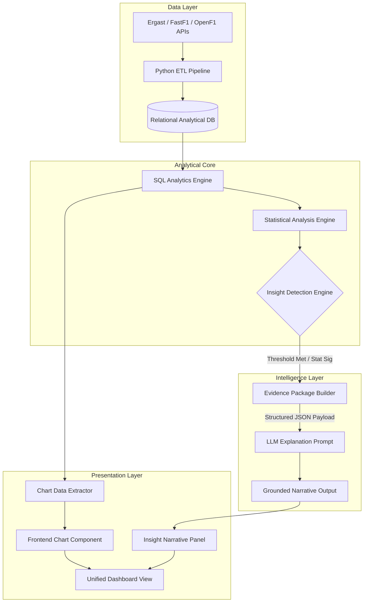
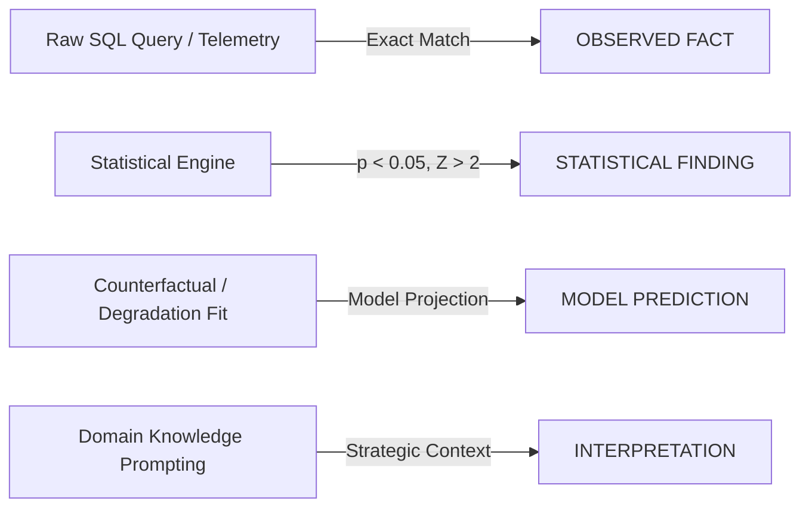
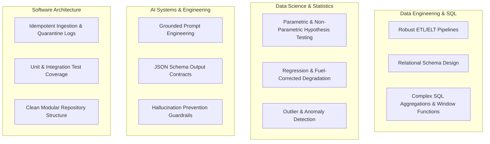
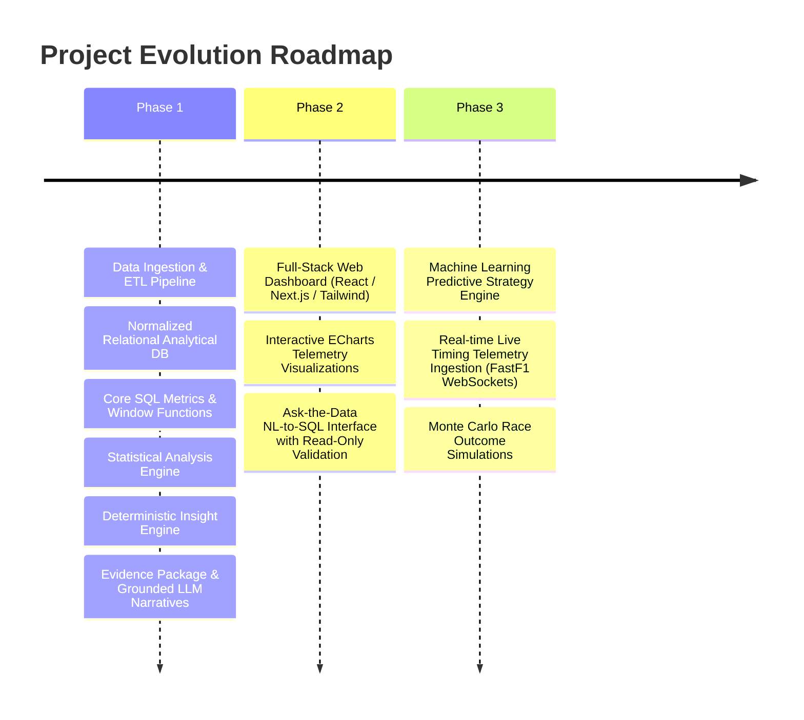

# F1 Race Intelligence — Product Specification

**Version:** 1.0.0  
**Status:** Approved  
**Author:** F1 Race Intelligence Architecture & Engineering Team  
**Last Updated:** 2026-09-01  

---

## Table of Contents

1. [Executive Summary & Project Overview](#1-executive-summary--project-overview)
   - 1.1 [Vision and Mission](#11-vision-and-mission)
   - 1.2 [Core Value Proposition](#12-core-value-proposition)
   - 1.3 [Strategic Objectives](#13-strategic-objectives)
2. [Core Philosophy & Architectural Flow](#2-core-philosophy--architectural-flow)
   - 2.1 [The End-to-End Pipeline](#21-the-end-to-end-pipeline)
   - 2.2 [The Truth Grounding Principle](#22-the-truth-grounding-principle)
   - 2.3 [System Flow Architecture](#23-system-flow-architecture)
3. [Target Audience & User Personas](#3-target-audience--user-personas)
   - 3.1 [Primary User Personas](#31-primary-user-personas)
   - 3.2 [User Needs Matrix](#32-user-needs-matrix)
4. [Core Product Features & Functional Requirements](#4-core-product-features--functional-requirements)
   - 4.1 [Feature A: Race Overview & Session Summary](#41-feature-a-race-overview--session-summary)
   - 4.2 [Feature B: Driver Analytics](#42-feature-b-driver-analytics)
   - 4.3 [Feature C: Constructor Analytics](#43-feature-c-constructor-analytics)
   - 4.4 [Feature D: Race Strategy Analytics](#44-feature-d-race-strategy-analytics)
   - 4.5 [Feature E: Statistical Analytics Engine](#45-feature-e-statistical-analytics-engine)
   - 4.6 [Feature F: Automated AI Insight Engine](#46-feature-f-automated-ai-insight-engine)
   - 4.7 [Feature G: Ask-the-Data Interface (Phase 2 Roadmap)](#47-feature-g-ask-the-data-interface-phase-2-roadmap)
5. [AI Architecture & Grounding Rules](#5-ai-architecture--grounding-rules)
   - 5.1 [The 5 Immutable Rules of AI Integration](#51-the-5-immutable-rules-of-ai-integration)
   - 5.2 [Evidence Package Data Contract](#52-evidence-package-data-contract)
   - 5.3 [Epistemic Classification System](#53-epistemic-classification-system)
6. [Visualization & Dashboard Principles](#6-visualization--dashboard-principles)
   - 6.1 [Data-Driven Rendering Pipeline](#61-data-driven-rendering-pipeline)
   - 6.2 [Chart Generation Guardrails](#62-chart-generation-guardrails)
7. [Data Quality, Integrity & Edge Case Handling](#7-data-quality-integrity--edge-case-handling)
   - 7.1 [Motorsport Domain Edge Cases](#71-motorsport-domain-edge-cases)
   - 7.2 [ETL Pipeline Integrity & Ingestion Safeguards](#72-etl-pipeline-integrity--ingestion-safeguards)
   - 7.3 [Historical Consistency & Schema Variations](#73-historical-consistency--schema-variations)
8. [Success Criteria & Competency Demonstration](#8-success-criteria--competency-demonstration)
   - 8.1 [Technical Competencies Demonstrated](#81-technical-competencies-demonstrated)
   - 8.2 [Verification & Portfolio Benchmarks](#82-verification--portfolio-benchmarks)
9. [Project Scope, Phasing & Non-Goals](#9-project-scope-phasing--non-goals)
   - 9.1 [In-Scope for Phase 1 (Foundation & Core Analytics Engine)](#91-in-scope-for-phase-1-foundation--core-analytics-engine)
   - 9.2 [Explicit Non-Goals for Phase 1](#92-explicit-non-goals-for-phase-1)
   - 9.3 [Future Phases Roadmap](#93-future-phases-roadmap)

---

## 1. Executive Summary & Project Overview

### 1.1 Vision and Mission
**F1 Race Intelligence** is an enterprise-grade Formula 1 analytics and race intelligence platform designed to bridge the gap between raw telemetry/timing data, rigorous statistical modeling, and natural-language narrative synthesis. 

Formula 1 generates millions of data points across practice, qualifying, sprint, and Grand Prix sessions. While existing commercial tools often present raw numbers without context, and generic AI tools frequently fabricate statistics or hallucinate race events, F1 Race Intelligence establishes a strictly deterministic, evidence-backed analytical pipeline. It ingests historical and live-season telemetry, computes statistical models and SQL-driven metrics, detects significant tactical and performance anomalies, and packages structured evidence before invoking Large Language Models (LLMs) purely as contextual synthesizers and narrative translators.

### 1.2 Core Value Proposition
- **Single Source of Truth:** Every insight, chart, and textual explanation is traceable to an underlying SQL query, statistical test, or deterministic calculation stored in a relational analytical database.
- **Automated Anomaly & Narrative Discovery:** The platform algorithmically surfaces non-obvious race stories—such as tire degradation inflection points, undercut efficiencies, intra-team qualifying pace divergence, and circuit-specific aerodynamic gains—without manual exploratory querying.
- **Hallucination-Free Generative AI:** By decoupling insight *detection* (deterministic Python/SQL) from insight *explanation* (LLM narrative synthesis), the platform eliminates LLM numerical hallucination.
- **Enterprise-Grade Engineering:** Built with industrial data engineering standards: structured ETL/ELT pipelines, robust relational schemas, defensive data validation, comprehensive unit/integration test suites, and transparent statistical methodology.

### 1.3 Strategic Objectives
1. **Transform Raw F1 Telemetry & Results:** Ingest multi-season historical and modern session data (Ergast API, OpenF1, FastF1, Formula 1 official timing archives) into a normalized analytical data warehouse.
2. **Execute Multi-Dimensional SQL & Statistical Analytics:** Provide low-latency, complex analytical queries across driver form, constructor trajectory, race strategy, pit-stop execution, and environmental impact.
3. **Automate Evidence-Driven Insights:** Detect anomalous performances, statistical shifts, and strategic pivots through deterministic statistical tests (Z-score anomaly detection, regression models, variance analysis, hypothesis testing).
4. **Deliver Grounded AI Narratives:** Format analytical outputs into structured Evidence Packages passed to LLMs to generate high-fidelity journalistic and engineering commentary.

---

## 2. Core Philosophy & Architectural Flow

### 2.1 The End-to-End Pipeline
The architecture follows a strict linear flow of data enrichment and verification. Information moves through progressive stages of increasing refinement:

```
┌─────────────┐     ┌─────────────┐     ┌─────────────┐     ┌────────────────┐
│  RAW DATA   │ ──► │  ETL / ELT  │ ──► │  DATABASE   │ ──► │  SQL ANALYTICS │
│ (APIs/JSON) │     │ (Clean/Val) │     │ (Relational)│     │  (Aggregates)  │
└─────────────┘     └─────────────┘     └─────────────┘     └────────────────┘
                                                                     │
                                                                     ▼
┌─────────────┐     ┌─────────────┐     ┌─────────────┐     ┌────────────────┐
│ DASHBOARD & │ ◄── │     AI      │ ◄── │  EVIDENCE   │ ◄── │  STATISTICAL   │
│ VISUALS     │     │ EXPLANATION │     │   PACKAGE   │     │    ANALYSIS    │
└─────────────┘     └─────────────┘     └─────────────┘     └────────────────┘
```

1. **RAW DATA:** Telemetry, lap times, pit stops, qualifying sessions, weather data, and race results collected from verified motorsport data APIs.
2. **ETL / ELT PIPELINE:** Robust Python extraction, cleansing, typing, constraint validation, deduplication, and relational ingestion.
3. **RELATIONAL DATABASE:** Normalized and indexed relational storage (PostgreSQL / SQLite analytical schema) maintaining strict foreign-key integrity and historical fidelity.
4. **SQL ANALYTICS:** Optimized analytical queries calculating cumulative points, moving averages, pace deltas, qualifying-to-race position changes, and constructor contributions.
5. **STATISTICAL ANALYSIS:** Python-based statistical engine applying variance decomposition, linear regression, distribution modeling, outlier detection, and hypothesis testing.
6. **INSIGHT DETECTION:** Deterministic algorithm scanning analytical outputs against pre-configured tactical thresholds and statistical significance boundaries ($p < 0.05$, $|z| > 2.0$).
7. **EVIDENCE PACKAGE:** Immutable JSON payload containing raw metrics, baseline comparators, statistical method names, $p$-values, confidence intervals, and chart metadata.
8. **AI EXPLANATION:** LLM consumes the structured Evidence Package and translates the mathematical finding into a concise, professional engineering or journalistic narrative.
9. **VISUALIZATION / DASHBOARD:** Client renders pre-computed charts directly from the structured dataset, complemented by the AI-generated narrative explanation.

### 2.2 The Truth Grounding Principle

> [!IMPORTANT]
> **The AI is NOT the source of truth; the database and analytical code are.**

The LLM is strictly confined to natural language synthesis, journalistic framing, and context summarization. It is strictly prohibited from:
- Calculating numbers, lap averages, pit stop losses, or point totals.
- Inventing race events, safety car periods, or mechanical failures.
- Predicting outcomes without referencing a formal machine learning or statistical model output.
- Rendering charts or plots from unverified generated data arrays.

### 2.3 System Flow Architecture



---

## 3. Target Audience & User Personas

### 3.1 Primary User Personas

```
┌──────────────────────────────────────────────────────────────────────────────────┐
│                             TARGET USER PERSONAS                                 │
├───────────────────┬───────────────────┬───────────────────┬──────────────────────┤
│ 1. Passionate F1  │ 2. Motorsport     │ 3. Data Analysts  │ 4. Fantasy F1 &      │
│    Fans           │    Journalists    │    & Engineers    │    Bettors           │
├───────────────────┼───────────────────┼───────────────────┼──────────────────────┤
│ Wants clear, deep │ Needs instant,    │ Evaluates code,   │ Requires predictive  │
│ tactical race     │ verified facts,   │ statistical       │ form metrics,        │
│ context beyond TV │ quotes, stats for │ rigor, SQL schemas│ teammate deltas, and │
│ broadcasts.       │ articles.         │ and methodologies.│ strategy variances.  │
└───────────────────┴───────────────────┴───────────────────┴──────────────────────┘
```

1. **Passionate Formula 1 Fans & Enthusiasts:**
   - *Goals:* Understand why a favorite driver won or lost, assess real race pace vs. traffic-affected pace, track tire degradation impact.
   - *Pain Points:* Mainstream TV commentary often simplifies complex pit strategy; official timing apps lack narrative synthesis.

2. **Sports Journalists & Content Creators:**
   - *Goals:* Rapidly find verified stats, records broken, teammate pace differentials, and unusual stint lengths to support race reports.
   - *Pain Points:* Fact-checking manual calculations takes hours; fear of publishing hallucinated AI statistics.

3. **Data Analysts, Data Scientists & Engineers:**
   - *Goals:* Inspect the underlying SQL queries, evaluate statistical distributions, audit regression models, and inspect clean datasets.
   - *Pain Points:* Black-box AI platforms providing vague claims without transparent statistical methods or data provenance.

4. **Fantasy F1 Players & Strategic Bettors:**
   - *Goals:* Identify undervalued drivers, circuit-specific setup advantages, qualifying vs. race conversion rates, and constructor reliability trends.
   - *Pain Points:* Raw point tallies hide underlying mechanical failures or bad safety car timing.

5. **Motorsport Researchers & Academics:**
   - *Goals:* Analyze historical multi-decade evolution of constructor dominance, pit-stop duration variance, and regulation cycle impacts.
   - *Pain Points:* Fragmented historical records and unstandardized data formats.

### 3.2 User Needs Matrix

| User Group | Key Required Feature | Critical Output Format | Trust Requirement |
| :--- | :--- | :--- | :--- |
| **Fans** | Race Story & Anomaly Breakdown | Executive Summaries & Visual Charts | Plain English + Visual Evidence |
| **Journalists** | Post-Race Fact Sheets & Records | Bulleted Evidence + Quotable Insights | Direct Source Citations + Zero Hallucinations |
| **Analysts** | Raw SQL Queries & Methodology | JSON Evidence Packages + CSV Exports | Mathematical Formulations & $p$-values |
| **Fantasy Players** | Form Index & Teammate Deltas | Comparative Radar Charts & Tables | Normalized Metrics across Circuits |

---

## 4. Core Product Features & Functional Requirements

### 4.1 Feature A: Race Overview & Session Summary
The Race Overview module delivers an end-to-end retrospective of any historical or current Grand Prix, Sprint, or Qualifying session.

- **Functional Capabilities:**
  - **Podium & Classification:** Winner, podium finishers, points scorers, DNFs, DNSs, and DSQs with precise official classifications.
  - **Grid vs. Finish Conversion:** Initial starting grid positions versus final classification, displaying net positions gained/lost ($P_{\text{gain}} = \text{Grid} - \text{Finish}$).
  - **Fastest Lap Analytics:** Driver, lap number, compound, average speed (km/h), and delta to the median lap pace of the top 10.
  - **Constructor Aggregations:** Total points scored per team in the session, double-podium checks, double-points finishes.
  - **Session Incident Summary:** Virtual Safety Car (VSC), full Safety Car (SC), and Red Flag deployment windows correlated with lap-time spikes.
  - **Key Metrics Table:** Total overtakes, average pit-stop duration, session attrition rate ($\frac{\text{DNFs}}{\text{Total Starters}}$).

### 4.2 Feature B: Driver Analytics
Comprehensive longitudinal and session-specific driver profiling across individual careers and single seasons.

- **Functional Capabilities:**
  - **Championship Standing & Trajectory:** Cumulative points over time, championship standing progression, distance to leader.
  - **Performance Benchmarks:** Career and season win rate, podium percentage, top-6 finishes, and points-per-race average.
  - **Qualifying Mastery vs. Race Craft:** Qualifying average position, race finishing average position, qualifying-to-race delta distribution.
  - **Reliability & DNF Profile:** Mechanical DNF rate vs. collision/driver error DNF rate.
  - **Teammate Head-to-Head Comparison:**
    - Qualifying pace delta (median gap in seconds on dry sessions).
    - Race finish head-to-head record (excluding unforced mechanical DNFs).
    - Points contribution percentage to constructor total ($\frac{\text{Driver Points}}{\text{Team Points}} \times 100$).
  - **Circuit Affinity Index:** Relative performance index across circuit archetypes (High Downforce, High Speed/Low Drag, Street Circuits, Bumpy/Low Grip).
  - **Recent Form Index:** Exponentially weighted moving average (EWMA) of finishing positions over the prior 5 races.

### 4.3 Feature C: Constructor Analytics
Team-level intelligence tracking aerodynamic development, operational execution, and intra-team dynamics.

- **Functional Capabilities:**
  - **Championship Trajectory:** Constructor standings evolution, points gap to immediate rivals.
  - **Driver Contribution Balance:** Balance ratio between Driver 1 and Driver 2 points; Gini coefficient of team points distribution.
  - **Qualifying vs. Race Pace Delta:** Constructor aerodynamic efficiency proxy (Saturday one-lap pace vs. Sunday long-run race pace degradation).
  - **Mechanical Reliability Index (MRI):** Mean laps completed before mechanical failure per season.
  - **Operational & Pit Crew Ranking:** Median pit-stop duration, stationary time standard deviation, pit crew consistency ranking.
  - **Development Trajectory Curve:** Year-over-year and round-over-round performance gain relative to the field median lap time.

### 4.4 Feature D: Race Strategy Analytics
Granular pit-stop, tire stint, and track-position analytics.

- **Functional Capabilities:**
  - **Stint Breakdown:** Compound selection (Soft, Medium, Hard, Intermediate, Wet), stint start lap, stint end lap, total laps run.
  - **Tire Degradation Estimation:** Linear and polynomial regression slope of lap times across stints (filtering for fuel burn-off correction $\approx -0.06\text{s/lap}$).
  - **Pit Stop Windows & Deltas:** In-lap time, stationary pit time, out-lap time, total pit-lane delta time.
  - **Undercut & Overcut Evaluation:** Delta in track position and gap between competing drivers across 3 laps before and after pit-stops.
  - **Rigorous Strategy Evaluation Rule:**
    > [!WARNING]
    > **No Claims of "Optimal Strategy" Without Empirical Proof:** The platform shall NEVER assert a strategy was "optimal" or "flawed" based on intuition. Any strategic claim must be accompanied by empirical counterfactual evidence (e.g., traffic exit window simulation, degradation differential, or delta to median competitor on alternative compound).

### 4.5 Feature E: Statistical Analytics Engine
A dedicated Python analytical module executing standard, documented mathematical operations on SQL query results.

```
┌──────────────────────────────────────────────────────────────────────────────────┐
│                        STATISTICAL ANALYTICS METHODS                             │
├─────────────────────┬─────────────────────┬──────────────────────────────────────┤
│ Method Category     │ Specific Technique  │ Formula / Application in F1 Domain   │
├─────────────────────┼─────────────────────┼──────────────────────────────────────┤
│ 1. Correlation      │ Pearson & Spearman  │ Qualifying Pos vs Race Finish Pos;   │
│                     │ Rank Correlation    │ Ambient Temp vs Tire Degradation     │
├─────────────────────┼─────────────────────┼──────────────────────────────────────┤
│ 2. Regression       │ Ordinary Least      │ Fuel-corrected Tire Lap Pace Decay   │
│                     │ Squares (OLS)       │ $y = \beta_0 + \beta_1(\text{Lap})   │
├─────────────────────┼─────────────────────┼──────────────────────────────────────┤
│ 3. Dispersion &     │ IQR, Variance,      │ Lap-Time Consistency Index;          │
│    Distributions    │ Standard Deviation  │ Pit-Stop Stationary Time Variance    │
├─────────────────────┼─────────────────────┼──────────────────────────────────────┤
│ 4. Anomaly &        │ Z-Score & Modified  │ Identifying anomalous lap times or   │
│    Outlier Checks   │ Z-Score (MAD)       │ unexpected underperformance $|z|>2$ │
├─────────────────────┼─────────────────────┼──────────────────────────────────────┤
│ 5. Hypothesis       │ Two-Sample t-Test,  │ Validating teammate pace delta       │
│    Testing          │ Mann-Whitney U      │ significance ($p < 0.05$)            │
├─────────────────────┼─────────────────────┼──────────────────────────────────────┤
│ 6. Trend Smoothing  │ Rolling Average,    │ Driver 5-Race Recent Form Index      │
│                     │ EWMA                │ $\text{EWMA}_t = \alpha y_t + (1-\a) │
├─────────────────────┼─────────────────────┼──────────────────────────────────────┤
│ 7. Estimation       │ 95% Confidence      │ True mean lap-time differential on   │
│    Uncertainty      │ Intervals (CI)      │ identical compound stints            │
└─────────────────────┴─────────────────────┴──────────────────────────────────────┘
```

- **Methodology Documentation Requirement:** Every statistical output must declare:
  1. Input sample size ($N$).
  2. Degrees of freedom ($df$).
  3. Calculated test statistic ($t, z, r, F, U$).
  4. Two-tailed $p$-value.
  5. Practical effect size (e.g., Cohen's $d$, Pearson's $r$).

### 4.6 Feature F: Automated AI Insight Engine
The Insight Detection Engine scans relational query results and statistical test outputs to discover high-value tactical narratives automatically.

- **10 Core Deterministic Insight Triggers:**
  1. `UNEXPECTED_UNDERPERFORMANCE`: Driver finishing $\ge 4$ positions below qualifying position without mechanical damage/collision record.
  2. `SIGNIFICANT_IMPROVEMENT`: Driver gaining $\ge 6$ positions from starting grid to final classification.
  3. `CONSTRUCTOR_PERFORMANCE_SHIFT`: Team scoring $>40\%$ more/fewer points over a 3-race window compared to season rolling average ($p < 0.05$).
  4. `TEAMMATE_PACE_DIVERGENCE`: Teammate qualifying or race pace delta exceeding $2.5\sigma$ of historical intra-team distribution.
  5. `UNUSUAL_PIT_STRATEGY`: Divergent pit count (e.g., 1-stop vs. field 2-stop) or extreme stint length exceeding $1.5 \times \text{IQR}$ of compound usage.
  6. `CIRCUIT_SPECIFIC_ADVANTAGE`: Driver/constructor outperforming season mean finishing position by $>3.0$ positions at a specific circuit archetype.
  7. `PACE_INFLECTION_DEGRADATION`: Tire lap pace degradation slope increasing by $>0.15\text{s/lap}^2$ indicating thermal cliff.
  8. `RELIABILITY_ANOMALY`: Constructor suffering $\ge 2$ mechanical DNFs across 2 consecutive race weekends.
  9. `LARGE_POSITION_GAIN_AT_START`: Driver gaining $\ge 3$ positions on Lap 1 of the Grand Prix.
  10. `HISTORICAL_RECORD_ANOMALY`: Equaling or surpassing a historical milestone (e.g., youngest podium, longest consecutive points streak, constructor win streaks).

- **Pipeline Execution:**
  $$\text{Clean DB} \xrightarrow{\text{SQL}} \text{Session Data} \xrightarrow{\text{Stats Engine}} \text{Trigger Rules Evaluation} \xrightarrow{\text{Hit}} \text{Evidence Package JSON} \xrightarrow{\text{LLM}} \text{Formatted Insight}$$

### 4.7 Feature G: Ask-the-Data Interface (Phase 2 Roadmap)
*Architectural specification for future implementation (Excluded from Phase 1).*

- **Architecture Plan:**
  - Natural Language User Query $\rightarrow$ Prompt Template with DB Schema DDL $\rightarrow$ LLM generates read-only SQL $\rightarrow$ AST SQL Query Parser & Sanitizer (Blocks `DROP`, `UPDATE`, `INSERT`, `ALTER`, permits only `SELECT`) $\rightarrow$ Isolated Read-Only SQLite/PostgreSQL Connection $\rightarrow$ Query Result Set $\rightarrow$ LLM Synthesizes Natural Language Answer referencing exact SQL result rows.

---

## 5. AI Architecture & Grounding Rules

### 5.1 The 5 Immutable Rules of AI Integration

```
┌──────────────────────────────────────────────────────────────────────────────────┐
│                       THE 5 IMMUTABLE RULES OF AI INTEGRATION                    │
├──────────────────────────────────────────────────────────────────────────────────┤
│ 1. LLM IS NOT THE SOURCE OF TRUTH                                                │
│    The database, SQL queries, and Python statistical scripts are the sole truth. │
├──────────────────────────────────────────────────────────────────────────────────┤
│ 2. STRICT NUMERICAL ORIGIN VERIFICATION                                          │
│    Every number in an output must originate from verified computed data.         │
├──────────────────────────────────────────────────────────────────────────────────┤
│ 3. GROUNDED EVIDENCE ANCHORING                                                   │
│    AI explanations must directly cite items present in the Evidence Package.     │
├──────────────────────────────────────────────────────────────────────────────────┤
│ 4. EPISTEMIC RIGOR & OUTPUT CLASSIFICATION                                       │
│    AI must explicitly label statements: Fact vs. Stat Finding vs. Prediction.    │
├──────────────────────────────────────────────────────────────────────────────────┤
│ 5. STANDARDIZED INSIGHT DATA CONTRACT                                            │
│    All insights adhere to an immutable, schema-validated JSON data structure.    │
└──────────────────────────────────────────────────────────────────────────────────┘
```

#### Rule 1: LLM is NOT the Source of Truth
The LLM cannot be queried directly for historical statistics, race outcomes, or lap times. It is used strictly as an epistemic transformation layer: converting verified, structured evidence into human-readable narratives.

#### Rule 2: Strict Numerical Origin Verification
Every numerical value present in generated summaries, titles, or explanations must have an exact 1:1 match with an entry in the structured Evidence Package. If the evidence states a pace gap was `0.342` seconds, the AI cannot round or state `0.4` seconds unless an explicit rounding rule is defined in the prompt contract.

#### Rule 3: Grounded Evidence Anchoring
The LLM prompt is injected with a strictly delimited JSON Evidence Package. The system instructions mandate that the LLM must refuse to answer or omit any claim that cannot be verified by the provided JSON payload.

#### Rule 4: Epistemic Rigor & Output Classification
Every sentence produced by the AI Engine must adhere to a four-tier classification model:
- `OBSERVED_FACT`: An immutable record in the database (e.g., "Max Verstappen finished P1").
- `STATISTICAL_FINDING`: The result of a mathematical test (e.g., "The pace difference of 0.28s was statistically significant, $p = 0.012$").
- `MODEL_PREDICTION`: The output of a predictive or counterfactual model (e.g., "Tire degradation models estimated a 2-stop strategy would be 4.2s faster in clean air").
- `INTERPRETATION`: Domain-informed tactical context explaining why the data looks as it does.

#### Rule 5: Standardized Insight Data Contract
All insights emitted by the system must conform strictly to the standard JSON schema defined below.

### 5.2 Evidence Package Data Contract

```json
{
  "$schema": "https://json-schema.org/draft/2020-12/schema",
  "title": "F1InsightEvidencePackage",
  "type": "object",
  "required": [
    "insight_id",
    "trigger_type",
    "title",
    "severity",
    "confidence_score",
    "epistemic_classification",
    "metrics",
    "methodology",
    "evidence_records",
    "ai_explanation",
    "visualization_metadata"
  ],
  "properties": {
    "insight_id": { "type": "string", "format": "uuid" },
    "trigger_type": { 
      "type": "string", 
      "enum": [
        "UNEXPECTED_UNDERPERFORMANCE",
        "SIGNIFICANT_IMPROVEMENT",
        "CONSTRUCTOR_PERFORMANCE_SHIFT",
        "TEAMMATE_PACE_DIVERGENCE",
        "UNUSUAL_PIT_STRATEGY",
        "CIRCUIT_SPECIFIC_ADVANTAGE",
        "PACE_INFLECTION_DEGRADATION",
        "RELIABILITY_ANOMALY",
        "LARGE_POSITION_GAIN_AT_START",
        "HISTORICAL_RECORD_ANOMALY"
      ] 
    },
    "title": { "type": "string", "maxLength": 100 },
    "summary": { "type": "string", "maxLength": 280 },
    "severity": { "type": "string", "enum": ["INFO", "NOTABLE", "SIGNIFICANT", "CRITICAL"] },
    "confidence_score": { "type": "number", "minimum": 0.0, "maximum": 1.0 },
    "epistemic_classification": { 
      "type": "string", 
      "enum": ["OBSERVED_FACT", "STATISTICAL_FINDING", "MODEL_PREDICTION", "INTERPRETATION"] 
    },
    "metrics": {
      "type": "object",
      "properties": {
        "primary_metric_name": { "type": "string" },
        "observed_value": { "type": "number" },
        "baseline_value": { "type": "number" },
        "delta": { "type": "number" },
        "unit": { "type": "string" }
      },
      "required": ["primary_metric_name", "observed_value", "baseline_value", "delta", "unit"]
    },
    "methodology": {
      "type": "object",
      "properties": {
        "statistical_test": { "type": "string" },
        "sample_size": { "type": "integer" },
        "test_statistic": { "type": "number" },
        "p_value": { "type": ["number", "null"] },
        "confidence_interval_95": {
          "type": "array",
          "items": { "type": "number" },
          "minItems": 2,
          "maxItems": 2
        }
      },
      "required": ["statistical_test", "sample_size"]
    },
    "evidence_records": {
      "type": "array",
      "items": {
        "type": "object",
        "properties": {
          "source_table": { "type": "string" },
          "query_hash": { "type": "string" },
          "record_data": { "type": "object" }
        },
        "required": ["source_table", "record_data"]
      }
    },
    "ai_explanation": {
      "type": "object",
      "properties": {
        "grounded_narrative": { "type": "string" },
        "tactical_context": { "type": "string" },
        "evidence_citations": {
          "type": "array",
          "items": { "type": "string" }
        }
      },
      "required": ["grounded_narrative", "evidence_citations"]
    },
    "visualization_metadata": {
      "type": "object",
      "properties": {
        "recommended_chart_type": { 
          "type": "string", 
          "enum": ["LINE_CHART", "BAR_CHART", "SCATTER_PLOT", "BOX_PLOT", "HEATMAP", "RADAR"] 
        },
        "x_axis_key": { "type": "string" },
        "y_axis_key": { "type": "string" },
        "series_keys": { "type": "array", "items": { "type": "string" } }
      },
      "required": ["recommended_chart_type", "x_axis_key", "y_axis_key"]
    }
  }
}
```

### 5.3 Epistemic Classification System

To maintain uncompromised scientific and journalistic credibility, all AI insights flag their statements with explicit epistemic confidence levels:



---

## 6. Visualization & Dashboard Principles

### 6.1 Data-Driven Rendering Pipeline
All charts, graphs, and telemetry visualizations are rendered directly from SQL/Python structured data arrays. The LLM produces **zero** chart data points.

```
┌─────────────────────┐
│  Analytics Engine   │ (Computes lap time deltas, positions, distributions)
└──────────┬──────────┘
           │
           ▼
┌─────────────────────┐
│ Structured Dataset  │ (Clean JSON / Pandas / Arrow array of points)
└──────────┬──────────┘
           │
           ▼
┌─────────────────────┐
│ Chart Configuration │ (ECharts / Plotly JSON spec with x, y, series)
└──────────┬──────────┘
           │
           ▼
┌─────────────────────┐
│   Frontend Chart    │ (Rendered deterministically in browser / UI)
└──────────┬──────────┘
           │
           ▼
┌─────────────────────┐
│    AI Explanation   │ (Contextual text referencing exact chart coordinates)
└─────────────────────┘
```

### 6.2 Chart Generation Guardrails
1. **No Synthetic Chart Ingestion:** The frontend dashboard components will strictly consume structured data arrays produced by backend Python endpoints.
2. **Standardized Visualization Mappings:**
   - *Lap Pace Evolution:* Line chart with rolling mean and variance bands.
   - *Driver/Constructor Form:* Line chart with moving averages and CI ribbons.
   - *Teammate Comparison:* Box plots (lap distributions) and radar charts (skill attributes).
   - *Stint Degradation:* Scatter plot with OLS linear regression fit line.
   - *Pit-Stop Efficiency:* Horizontal bar chart sorted by median stationary time with error bars ($\pm 1\sigma$).

---

## 7. Data Quality, Integrity & Edge Case Handling

Motorsport data is notorious for non-standard session events, weather disruptions, and regulatory penalties. The ETL pipeline enforces strict domain-specific rules.

### 7.1 Motorsport Domain Edge Cases

```
┌──────────────────────────────────────────────────────────────────────────────────┐
│                       MOTORSPORT EDGE CASE HANDLING MATRIX                       │
├─────────────────────┬────────────────────────────────────────────────────────────┤
│ Edge Case Condition │ Pipeline Handling & Normalization Strategy                 │
├─────────────────────┼────────────────────────────────────────────────────────────┤
│ 1. DNF, DNS, DSQ    │ Encoded with explicit status codes. Excluded from clean    │
│    Classifications  │ pace distributions; retained in attrition & reliability.   │
├─────────────────────┼────────────────────────────────────────────────────────────┤
│ 2. Pit Lane Starts  │ `grid_position` set to 0 or explicit pit lane indicator.   │
│    & Penalties      │ Position gained/lost calculated against actual start lane. │
├─────────────────────┼────────────────────────────────────────────────────────────┤
│ 3. Red Flags &      │ Safety car and red flag laps flagged with `is_neutralized` │
│    Neutralizations  │ boolean; removed from tire degradation OLS regressions.    │
├─────────────────────┼────────────────────────────────────────────────────────────┤
│ 4. Rain & Compound  │ Intermediate/Wet stints isolated; pace normalized only     │
│    Transitions      │ against concurrent wet-weather lap distributions.          │
├─────────────────────┼────────────────────────────────────────────────────────────┤
│ 5. Sprint Weekends  │ Sprint Shootout, Sprint Race, and Main Qualifying stored   │
│    & Format Shifts  │ in distinct session entities with explicit session types.  │
├─────────────────────┼────────────────────────────────────────────────────────────┤
│ 6. Half Points &    │ Ingestion of official FIA awarded points with point        │
│    Shortened Races  │ multiplier flag (`points_awarded_scale: 0.5`).             │
└─────────────────────┴────────────────────────────────────────────────────────────┘
```

### 7.2 ETL Pipeline Integrity & Ingestion Safeguards
- **Zero-Loss Data Retention Policy:** Never silently discard anomalous or unparseable records. Records failing validation are quarantined in an `etl_quarantine_records` table with the raw payload and error traceback.
- **Pagination & Rate Limiting:** All upstream API calls wrap around exponential backoff retry handlers (HTTP 429 / 503 resilience) with token bucket rate limiters.
- **Idempotent Ingestion:** Every session ingestion script uses `UPSERT` / `ON CONFLICT DO UPDATE` mechanisms keyed on unique composite keys (e.g., `(season, round, session_type, driver_id)`).

### 7.3 Historical Consistency & Schema Variations
- **Pre-2010 vs. Modern Point Systems:** Normalized points tables store both raw historic points awarded and normalized modern equivalent points (25-18-15-12-10-8-6-4-2-1) for longitudinal cross-era driver comparison.
- **Name & Constructor Lineage Mapping:** Entity resolution mapping teams across historical rebrandings (e.g., Jordan $\rightarrow$ Midland $\rightarrow$ Spyker $\rightarrow$ Force India $\rightarrow$ Racing Point $\rightarrow$ Aston Martin).

---

## 8. Success Criteria & Competency Demonstration

The F1 Race Intelligence platform is architected to serve as a portfolio-grade demonstration of enterprise data engineering, statistics, and AI systems development.

### 8.1 Technical Competencies Demonstrated



1. **Data Engineering:** Automated, resilient ETL pipelines, relational database modeling (3NF / Star Schema), composite indexing, data integrity constraints, quarantine handling.
2. **SQL Mastery:** Advanced window functions (`LAG`, `LEAD`, `DENSE_RANK`, `AVG() OVER PARTITION`), common table expressions (CTEs), multi-table joins, subqueries, and execution query plan optimization.
3. **Statistical Science:** Rigorous hypothesis testing ($t$-test, Mann-Whitney $U$), OLS regression modeling, variance decomposition, IQR outlier detection, EWMA smoothing.
4. **AI & Generative Systems:** Grounded LLM synthesis, schema-constrained generation, prompt orchestration, automated evidence packaging, strict epistemic classification.
5. **Software Engineering:** Strict typing (Python `typing`, `Pydantic`), complete unit/integration test coverage (`pytest`), modular codebase architecture, CI/CD readiness.

### 8.2 Verification & Portfolio Benchmarks
- **100% Metric Traceability:** Any displayed metric in an insight can be programmatically matched to an automated SQL query test in the verification suite.
- **0% Hallucination Rate:** Zero instances of LLM inventing driver names, lap counts, pit durations, or ungrounded statistics.
- **Deterministic Reproducibility:** Running the statistical engine across historical sessions yields identical Insight IDs, $p$-values, and metric values.

---

## 9. Project Scope, Phasing & Non-Goals

### 9.1 In-Scope for Phase 1 (Foundation & Core Analytics Engine)
- Complete database schema and migrations for F1 historical sessions.
- Ingestion and ETL scripts for modern and historical F1 seasons (Ergast / FastF1 data loaders).
- Core SQL analytical view library and analytical queries.
- Statistical analysis engine (regression, distributions, teammate deltas, anomaly detection).
- Deterministic Insight Detection Engine with 10 trigger rules.
- Evidence Package builder and JSON schema validator.
- Grounded AI explanation module using LLM prompts with evidence injection.
- End-to-end command-line runner and JSON export suite for session analysis.

### 9.2 Explicit Non-Goals for Phase 1

> [!CAUTION]
> The following items are explicitly **OUT OF SCOPE** for Phase 1 to ensure technical depth and architectural integrity in core data and analytical layers:

- ❌ **No Complex Frontend UI:** No React, Next.js, or web dashboard implementation in Phase 1 (Focus is backend data engineering, SQL, statistics, and CLI/JSON pipelines).
- ❌ **No Predictive Machine Learning Models:** No XGBoost/Neural Network race winner predictors or real-time lap-time forecasting in Phase 1.
- ❌ **No Conversational AI Chatbot:** No free-form conversational chat interface or multi-turn agent conversations.
- ❌ **No Natural Language-to-SQL (NL-to-SQL):** No dynamic SQL query generation from arbitrary user prompts.
- ❌ **No Synthetic / Mock Data:** No fabricated race datasets; all analytics operate exclusively on authentic historical F1 data.

### 9.3 Future Phases Roadmap



---
*End of Product Specification.*
